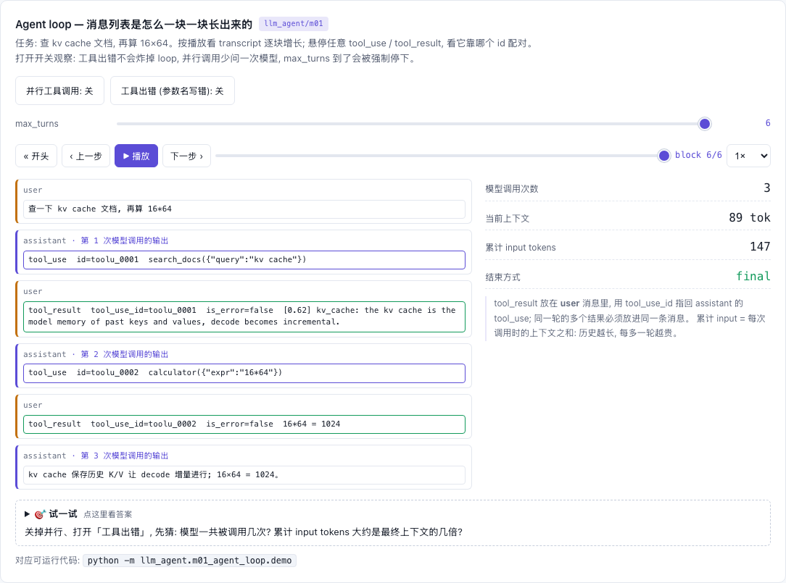

# llm_agent — LLM 应用层 / Agent 教学章节

[](https://beleev.github.io#/agent/loop)

[打开相关交互实验：Agent loop — 消息列表是怎么一块一块长出来的 llm_agent/m01](https://beleev.github.io#/agent/loop)

[项目首页](../README.md) · [在线教程](https://beleev.github.io/llm-engineering-lab/#/agent)

## 概览

> 用纯 Python stdlib 写一个可运行、可断言的 agent harness, 讲清楚生产级 agent 的关键机制:
> 循环、工具、权限、上下文、扩展、持久化、子智能体、MCP、规划、护栏、评测。
> 设计刻意对齐 Claude Code (权限模式名、hook 事件名、`mcp__server__tool` 命名) 和 Claude Messages API (content block 格式)。

### 设计目标

- **原理优先**: 默认"模型"是 `RuleBasedLLM` (关键词规则), 行为完全确定 —— 所以每个 demo 都能用 `assert` 证明自己声称的行为, 而不是无条件打印 OK。
- **一个 loop, 任意模型**: `core/llm.py` 的 `LLM` 协议只有一个方法 `next(messages, tools) -> ModelAction`。换成 `core/claude_llm.py` 的真实模型, loop 一行不改 (m15, opt-in)。
- **transcript 即 API 格式**: assistant 的 `tool_use` 与 user 的 `tool_result` 都是 content block, 按 id 配对。落盘的 JSONL 里还有 system 角色的消息和 `name` 字段, 发给真实 API 前要经 `core/claude_llm.py: to_api_messages` 转换 (m15)。
- **安全可跑**: `ShellTool` 只模拟、永不执行; 没有网络; 文件只写临时目录; 唯一的子进程是 m09 用 `sys.executable` 拉起本包自己的 MCP server。
- **零依赖**: 默认路径只用 stdlib。CI 在 Python 3.10 和 3.13 上跑。

## 运行

```bash
# 在仓库根目录
python -m llm_agent.run_all                 # 全部默认 demo, 任何断言失败即非零退出
python -m llm_agent.m03_permissions.demo    # 单模块
python -m llm_agent.full_loop.demo          # 组合闭环

# 可选: 真实模型 (需要 pip install anthropic + ANTHROPIC_API_KEY; 否则只跑离线检查后礼貌退出)
python -m llm_agent.m15_claude_api.demo
```

## 模块与阅读顺序

### 学习路径

```
m01 Agent Loop ─ m02 Tool Use ─ m03 Permissions ─ m04 Context & Memory      基础: 一个能行动、受约束的 loop
      │
m05 Skills & Hooks ─ m06 Persistence ─ m07 Subagents ─ m08 Retrieval        扩展: 可定制、可恢复、可分工、有知识
      │
m09 MCP ─ m10 Planning ─ m11 Orchestrator ─ m12 Guardrails                  进阶: 外部工具、先计划后动手、并行分工、防注入
      │
m13 Evals ─ m14 Context Engineering ─ (m15 真实模型, opt-in)                 工程化: 怎么知道它变好了, 怎么让它跑得久
      │
m16 RAG ─ m17 Computer Use ─ m18 A2A ─ m19 Prompt Caching                  扩展面: 知识、界面、别的 agent、成本
      │
full_loop  把以上全部拼在一起, 逐场景断言
```

### 模块清单

| # | 模块 | 讲什么 | 机制所在 |
|---|------|--------|----------|
| 01 | [Agent Loop](m01_agent_loop/) | while 循环、tool_use / tool_result block、按轮次推理 | `core/agent.py` `core/schema.py` |
| 02 | [Tool Use](m02_tool_use/) | JSON Schema 工具定义、执行前校验、并行工具调用 | `core/tools.py` |
| 03 | [Permissions](m03_permissions/) | deny > ask > allow、模式、命令归一化、黑名单的局限 | `core/permissions.py` |
| 04 | [Context & Memory](m04_context_memory/) | 文件记忆 (含中文)、清理 / 摘要 / 截断三档对比 | `core/memory.py` |
| 05 | [Skills & Hooks](m05_extensibility/) | SKILL.md 渐进式披露、7 个 hook 事件、hook 绕不过权限 | `core/skills.py` `core/hooks.py` |
| 06 | [Persistence](m06_persistence_resume/) | append-only JSONL、resume、权限不随会话恢复 | `core/persistence.py` |
| 07 | [Subagents](m07_subagents/) | 隔离上下文、只回摘要、子 transcript 落盘 | `core/subagents.py` |
| 08 | [Retrieval](m08_retrieval/) | TF-IDF 余弦、BM25 式 idf、中文 bigram、工具热替换 | `core/retrieval.py` |
| 09 | [MCP](m09_mcp/) | 真实 stdio JSON-RPC server/client、工具命名空间、同一权限门 | `core/mcp.py` `m09_mcp/server.py` |
| 10 | [Planning](m10_planning/) | todo 工具、plan 模式 (批准前只读)、并行调用计时 | `core/tools.py` `core/permissions.py` |
| 11 | [Orchestrator](m11_orchestrator/) | lead 扇出并行 worker、不同工具集、token 两本账 | `core/subagents.py` |
| 12 | [Guardrails](m12_guardrails/) | prompt injection (标记 + 污点)、路径围栏、密钥脱敏 | `core/guardrails.py` `core/sandbox.py` |
| 13 | [Evals](m13_evals/) | 终态 grader、轨迹检查、pass@k / pass^k、回归对比 | `m13_evals/demo.py` |
| 14 | [Context Engineering](m14_context_engineering/) | 工具结果清理、模型摘要压缩 (resume 真的变小)、即时检索、记忆工具 | `core/agent.py` `core/memory.py` |
| 15 | [Claude API](m15_claude_api/) | 真实模型适配器 (opt-in, 不在 run_all) | `core/claude_llm.py` |
| 16 | [RAG](m16_rag/) | 定长 vs 结构切块、BM25、字符 n-gram 稠密向量、RRF 混合、rerank、recall@k / MRR | `m16_rag/demo.py` |
| 17 | [Computer Use](m17_computer_use/) | 无障碍树快照 → click / type / scroll、ref vs 坐标点击、页面注入拦截 | `m17_computer_use/demo.py` |
| 18 | [A2A](m18_a2a/) | Agent Card、任务状态机 (input-required)、artifact、与 MCP 的分工 | `m18_a2a/demo.py` |
| 19 | [Prompt Caching](m19_prompt_caching/) | cache_control 断点、前缀字节匹配、写贵读便宜、TTL、时间戳反例 | `m19_prompt_caching/demo.py` |
| ★ | [Full Loop](full_loop/) | 全部机制组合, 5 个场景逐一断言 | — |

## 实现说明

### 一次工具调用在 loop 里的完整路径

```
模型 → assistant[tool_use...]  ──先写入 transcript──►  JSONL
        │ 对每个 tool_use (串行):
        │   PreToolUse hook (可拦截 / 改写)
        │   污点检查 (本轮读过不可信数据 → 高风险工具锁死)
        │   权限门 evaluate(改写后的最终调用)      ← hook 不是提权通道
        ▼
   通过的调用 → 线程池并行执行 (先按 JSON Schema 校验参数)
        ▼
   脱敏 → 不可信输出包 <untrusted_data> → PostToolUse hook (注释走旁路 system 消息)
        ▼
   user[tool_result...] (全部结果同一条消息) → 超预算? 清旧结果 → 摘要压缩 → 再问模型
```

## 边界

### 业界覆盖度自评

| 技术 | 状态 | 说明 |
|---|:---:|---|
| Agent loop / tool use content blocks | yes | m01, 与 Messages API 同构 |
| JSON Schema 工具 + 参数校验 | partial | 一层 schema 子集; 真实系统用 `strict: true` / jsonschema |
| 并行工具调用 | yes | m02 / m10, 线程池 |
| 权限: 规则 + 模式 + plan mode | yes | m03 / m10; 黑名单局限已当场演示 |
| OS 级沙箱 / 真实 shell | no | 教学安全: 只模拟; 路径围栏见 m12 |
| Hooks (7 事件) | yes | Stop 仅通知, 不能阻止结束 |
| Skills 渐进式披露 | yes | 两层 (目录 / 正文), 未做第三层附件 |
| MCP | partial | 真实 stdio + tools; 无 resources / prompts / HTTP / OAuth |
| 持久化 / resume / compact boundary | yes | m06 / m14 |
| Subagents / orchestrator-workers | yes | m07 / m11; lead 不会多轮重规划 |
| 检索 | partial | m08 TF-IDF; m16 切块 + BM25 + 字符级稠密 + RRF + rerank; 无神经 embedding / ANN |
| Computer use / A2A | partial | m17 模拟浏览器 (无真实渲染); m18 进程内 A2A (无 HTTP / 流式 / 推送) |
| Context editing / compaction / memory tool | yes | m14; 预算按字符, token 为估算 |
| Prompt injection 防护 / 脱敏 | partial | 正则特征 + 轮级污点; 无信息流追踪。各层挡不住什么, 见 m03 / m07 / m09 / m12 / m17 的「与真实系统的差距」 |
| Evals | partial | 小任务集; 无 LLM-as-judge、置信区间 |
| 真实 LLM | opt-in | m15; 无 streaming / 重试 |
| Prompt caching | partial | m19 离线模拟计费与 TTL; m15 的真实调用未启用 |

读完本目录再看 Claude Code / Claude Agent SDK / OpenHands / LangGraph, 可以把复杂系统拆成几条主线:
**模型怎么选动作、工具怎么执行、权限怎么拦、上下文怎么控、状态怎么留、子任务怎么隔离、不可信输入怎么防、改动之后怎么验。**
