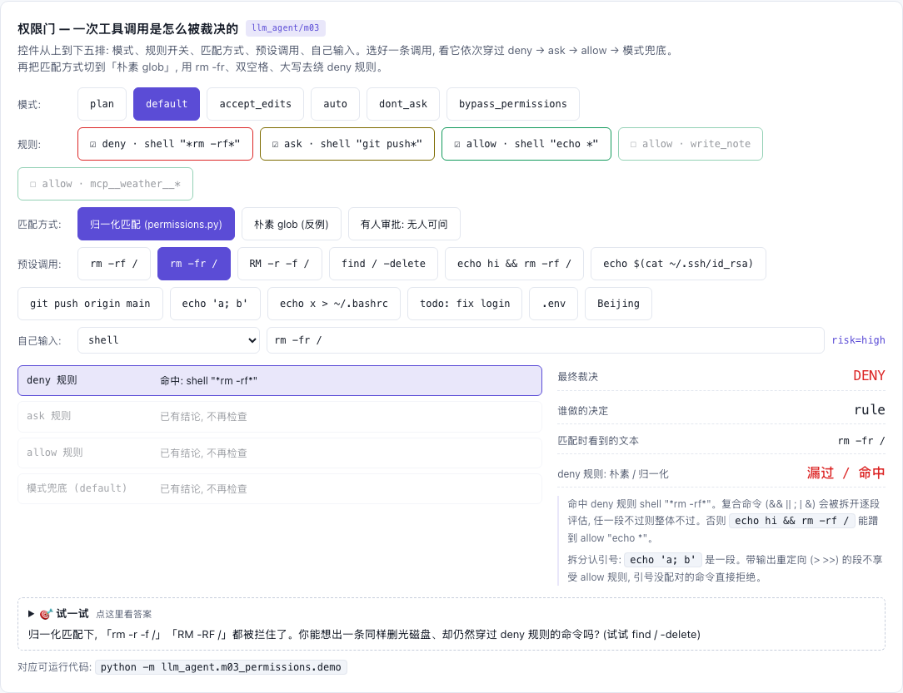

# M03 — Permissions

[](https://beleev.github.io#/agent/tools-permissions)

[打开相关交互实验：权限门 — 一次工具调用是怎么被裁决的 llm_agent/m03](https://beleev.github.io#/agent/tools-permissions)

## 直觉

没有权限门, 模型 (或者被注入了指令的文档) 想跑什么就跑什么。
反过来, 每一步都问人, agent 就没法用了。
权限系统要解决的是这两头之间的分配: 哪些直接放行, 哪些必须问人, 哪些永远不行, 以及没人可问时怎么办 (fail closed)。
本模块的另一半内容是演示黑名单的局限: deny 规则靠字符串匹配枚举"坏"的写法, 而等价写法无穷多。demo [4] 给出三个绕过。

## 核心原理

### 核心数据结构与控制流

- `core/permissions.py: PermissionRule` — `(tool glob, 参数 glob, decision, reason)`; `pattern` 为空表示匹配该工具的任何调用。
- `core/permissions.py: PermissionOutcome` — `allowed / decision / source / reason`; `source` 为 `rule / human / auto / 模式名`, 审计时要能回答"是谁放行的"。
- `core/permissions.py: normalize_command` — 小写、压空白、相邻短 flag 合并并排序: `RM  -r -f /` -> `rm -fr /`。规则的 pattern 和命令走同一个归一化。
- `core/permissions.py: split_command` — 用 `shlex` 按引号规则把 shell 命令切段, 返回 `[(段文本, 有没有输出重定向)]`; 引号没配对返回 `None`。
- `core/permissions.py: PermissionGate.evaluate(call, tool)` — 入口; `tool` 用来读 `tool.risk` 和 `tool.read_only`, 传 `None` (未知工具) 按 `risk="high"`、非只读处理。

```
evaluate(call, tool)
  shell -> split_command 按引号切段 (引号里的 ; & | > 是普通字符)
           引号没配对                      -> deny  (source=parser)
           每段单独 _evaluate_one; 任一段不放行 -> 整体不放行
           命令含 $(...) / 反引号, 或这一段有输出重定向 > >> -> 这一段跳过 allow 规则
  _evaluate_one:
    1. deny 规则命中            -> deny  (source=rule)      任何模式下都生效
    2. mode == plan             -> 跳过 ask / allow 规则, 直接到兜底
    3. ask 规则命中             -> 问人  (source=human)     bypass_permissions 跳过这一步
    4. allow 规则命中           -> allow (source=rule)
    5. 模式兜底:
         plan               tool.read_only ? allow : deny
         dont_ask           deny  (只有 allow 规则能放行)
         bypass_permissions allow
         accept_edits       risk == high ? 问人 : allow
         auto               _auto_classify (见下)
         default            问人
  问人: 没有 ask_policy -> deny (fail closed); dont_ask 模式不问, 直接 deny
```

关键设计:

- 优先级写死为 deny > ask > allow, 与规则书写顺序无关: `git push*` 的 ask 压过更宽的 `git *` allow, 加一条宽 allow 不会意外放开已有的限制。
- 复合命令必须逐段评估: `echo hi && rm -rf /` 整串可以匹配 allow `echo *`。
- 切段要认引号: `echo 'a; b'` 是一条命令, 按分号硬切会误拒。每段的文本是去掉引号后的词, `rm '-rf' /` 照样命中 `*rm -rf*`。
- 带输出重定向的段不享受 allow 规则: `echo x > ~/.bashrc` 整串匹配 allow `echo *`, 实际却在改文件。
- dont_ask 是"只认预先批准": 命中 allow 规则的放行, 其余 (包括命中 ask 规则的) 直接拒绝, 不问人。适合无人值守、又只想放开几条明确命令的场景。
- auto 模式的危险词只对有对应语义的参数生效: shell 的 `command` 和任意工具的 `path` 参数。
  - 若对所有参数做子串匹配, `search_docs "tokenizer"` (含 `token`) 和 `calculator "5 > 3"` (含 `>`) 都会被误杀。
  - 在一个讲 LLM 的库里, "token" 会天天出现。
- auto 模式下: low / medium 风险放行, high 风险且没看到危险词也不放行, 而是问人; 没人可问就拒绝。
- plan 模式里 allow 规则不生效: 只读是模式的保证, 不应被一条配置覆盖; 只有计划获批切换模式后才能写 (`ExitPlanModeTool`, 见 m10)。
- 在 agent loop 里 (`core/agent.py: Agent._authorize`), 门评估的是 PreToolUse hook 改写之后的最终调用。

## 运行

权限门: 每个工具调用执行前过一次 `deny > ask > allow > 模式兜底` 的判定; 同时当场演示字符串黑名单挡不住什么。

## 运行后应该看到什么

```bash
cd <仓库根目录> && python3 -m llm_agent.m03_permissions.demo
```

```
[1] default 模式 + 规则: deny > ask > allow
  shell       git status                         -> allow rule: git is fine
  shell       git push origin main               -> deny  human: pushing is visible to others; denied
  shell       rm -rf /tmp/demo                   -> deny  rule: destructive
  write_note  no rule matches                    -> deny  human: default mode asks for unknown action; denied
[2] 归一化堵住最廉价的绕过; 按引号切段, 逐段评估
  normalize('RM  -r -f /') = 'rm -fr /'
  shell       rm -r -f /tmp/demo                 -> deny  rule: destructive
  shell       echo hi && rm -rf /                -> deny  rule: destructive
  shell       echo hi & find / -delete           -> deny  human: default mode asks for unknown action; denied
  shell       echo $(find / -delete)             -> deny  human: default mode asks for unknown action; denied
  shell       echo 'a; b'                        -> allow rule: echo is harmless
  shell       echo x > ~/.bashrc                 -> deny  human: default mode asks for unknown action; denied
  shell       echo 'unclosed                     -> deny  parser: cannot parse shell command (unbalanced quotes)
[3] auto 模式: 按风险分级, 危险词只看 shell command / 文件 path
  search_docs tokenizer bpe secret sauce         -> allow auto: low-risk tool
  calculator  5 > 3                              -> allow auto: low-risk tool
  shell       cat token.txt > /tmp/x             -> deny  auto: classifier saw risky shell pattern
  shell       ls                                 -> deny  human: classifier unsure about high-risk tool; denied
[4] 字符串黑名单挡不住的写法 (以下全部漏过 deny 规则)
  shell       /bin/rm --recursive --force /      -> allow bypass_permissions: mode allows unknown action
  shell       find / -delete                     -> allow bypass_permissions: mode allows unknown action
  shell       python -c 'import shutil; shutil.rmtree("/")' -> allow bypass_permissions: mode allows unknown action
[5] plan 模式: 只读; allow 规则也放不了写操作
  search_docs anything                           -> allow plan: read-only tool
  write_note  blocked until approved             -> deny  plan: plan mode is read-only until the plan is approved
[6] dont_ask 模式: 只放行 allow 规则预先批准的, 其余直接拒绝, 不问人
  shell       git status                         -> allow rule: git is fine
  shell       git push origin main               -> deny  dont_ask: pushing is visible to others; dont_ask never asks
  write_note  no rule matches                    -> deny  dont_ask: not pre-approved by an allow rule
```

(节选, 每节省略了若干行。) 每一行都由 `show()` 断言 `(decision, source)` 二元组。

断言验证的内容:

- [1] allow 规则放行 `calculator` 和 `git status`; `git push` 走 ask 规则且"人"拒绝; `rm -rf` 被 deny 规则拦下; 没规则命中的 `write_note` 在 default 模式下问人。`asked` 列表恰好只有这两次询问。
- [2] `rm -fr` / `RM  -rf` / `rm -r -f` 三种写法都命中同一条 `*rm -rf*`; 复合命令因第二段被拒而整体被拒。`echo 'a; b'` 是一段, 命中 allow; `echo x > ~/.bashrc` 带重定向, 不算命中 allow, 落到问人; 引号没配对的命令由 `parser` 拒绝。
- [3] `search_docs` 和 `calculator` 没有被危险词误杀; 含 `token` 和 `>` 的 shell 命令被分类器拒绝; `ls` 是高风险工具, 无人可问, fail closed。
- [4] 三个绕过写法在 `bypass_permissions` + deny 规则下的结果确实是 `allow` —— 这个断言记录的是弱点, 不是功能。
- [5] plan 模式放行只读的 `search_docs`, 拒绝 `write_note`, 即使存在针对它的 allow 规则。
- [6] dont_ask 模式下只有 allow 规则命中的 `git status` 放行; 命中 ask 规则的 `git push` 和没有规则的 `write_note` 都是 `deny / dont_ask`, 而且这一节没有再调用 `ask_policy`。

## 与真实系统的差距

- 字符串匹配从根上就弱:
  - `normalize_command` 只处理大小写、空白、短 flag。
  - `/bin/rm`、`--recursive --force`、`find -delete`、`python -c` 全部漏过。
  - 真实系统的主力是三样: 把命令解析成 AST 逐段检查、默认拒绝的 allowlist、OS 级沙箱 (seatbelt / bubblewrap / 容器) 限制文件系统和网络。deny 列表只是最外层的便宜网。
- `split_command` 用 `shlex` 认引号, 按 `&& || ; | &` 和换行切段; 含 `$(...)` / 反引号的命令和带输出重定向的段不享受 allow 规则 (只能走 ask / 模式兜底)。它仍不是 shell 解析器:
  - here-doc、`eval`、变量展开、别名都没处理。
  - 引号里只有标点的词 (`echo ';'`) 会被当成操作符, 多切一段。结果只会更严。
  - 这类漏洞补不完, 需要真正的 shell 解析器。
- allow 规则这一侧仍有漏的 (以一条 allow `echo *` 为例):
  - 进程替换 `echo x <(cat /etc/passwd)` 和变量展开 `echo $HOME` 能匹配这条规则, 直接放行。
  - allow 规则匹配整段文本: 一条 allow `find *` 也会放行 `find / -delete`。
  - 所以 allow 规则只适合本来就没有副作用的命令。
- 归一化是为匹配服务的有损变换: 它会把 `-C` 小写成 `-c`, 把单横线长选项当作短 flag 排序 (`-delete` -> `-delt`)。只用于比较, 绝不能拿归一化后的字符串去执行。
- auto 模式的"分类器"是两张子串表, 误报漏报都多:
  - 命令里查 9 个词 (`rm `, `sudo`, `>`, `token` ...)。
  - `path` 参数里查 5 个词 (`.env`, `id_rsa`, `.ssh` ...)。
- `ask_policy` 是一个函数。没有真实的审批 UI、"本次会话始终允许"、规则持久化, 也没有多层配置来源 (用户 / 项目 / 企业策略) 的合并。
- 工具的 `risk` / `read_only` 是写工具的人自己填的类属性, 门无法验证:
  - `Tool` 基类的默认值是 `risk = "low"`、`read_only = True`。写一个会写盘的工具却忘了改, plan 和 auto 模式都会直接放行。
  - 门对未注册的工具正相反: 按 `risk="high"`、非只读处理。
  - 真实系统的默认值应该偏严 (high / 非只读), 要放宽得显式声明。
- `ShellTool` 是模拟的, 所以本模块可以放心演示绕过; 对真实 shell 做同样的实验需要沙箱。

## 常见误区

- "写够 deny 规则就安全了。" deny 列表是在枚举坏的写法, 而等价写法无穷多。安全边界应该是 allowlist 加 OS 沙箱, deny 规则只用来拦常见的误操作。
- "规则从上往下, 先命中先生效。" 这里 (以及 Claude Code 的 allow / ask / deny) 是按决策类型排优先级: 任何 deny 命中都赢, 其次 ask, 最后 allow, 与书写顺序无关。
- "没人应答时应该默认放行, 否则 agent 会卡住。" 无人值守恰恰是最该保守的场景: `_ask` 在没有 `ask_policy` 时返回 deny, 被拒的结果作为 `is_error` 的 `tool_result` 回给模型, 它可以换方案, loop 不会卡死。

## 自测题

1. 规则里同时有 ask `git push*` 和 allow `git *`。`git push origin main` 会怎样? 如果优先级改成"allow 先于 ask"会出什么问题?

<details><summary>答案</summary>
`_evaluate_one` 按 deny -> ask -> allow 的顺序扫描规则, ask 先命中, 于是问人 (demo 里"人"拒绝, 结果 `deny / human`)。如果 allow 优先, 任何一条较宽的 allow (如 `git *`) 都会悄悄吞掉更窄的 ask / 限制; 规则越多, 越难判断一条新 allow 到底放开了什么。限制性决策优先, 才能保证"加 allow 不会削弱已有保护"。
</details>

2. PreToolUse hook 可以改写工具调用。为什么权限门必须评估改写之后的调用, 而不是模型原始发出的那个?

<details><summary>答案</summary>
真正被执行的是改写后的调用。如果门只看原始调用, 一个有 bug 或被攻破的 hook 可以把无害的 `calculator` 改写成 `shell rm -rf`, 完全绕过 deny 规则。`Agent._authorize` 的顺序固定为 hook -> 权限门 -> 执行, 并且调用 `permissions.evaluate(final, tool)` 而不是 `evaluate(call, ...)`, 保证"过门的"和"执行的"是同一个对象。
</details>

3. demo [4] 用的是 `bypass_permissions` 模式。同样三条命令在 `auto` 或 `default` 模式下不会被直接放行, 这是否说明黑名单的问题已经解决?

<details><summary>答案</summary>
没有。实测: `default` 下三条都是 `deny / human`; `dont_ask` 下三条都是 `deny / dont_ask`; `auto` 下后两条是 `deny / human`, 第一条是 `deny / auto`, 但那只是 `/bin/rm ` 碰巧含子串 `rm `。也就是说拦住它们的是 `shell` 的 `risk="high"` 触发的"问人, 没人就拒绝", 是默认拒绝在起作用, 不是 deny 规则识别出了危险。deny 规则对这三种写法依然视而不见; 一旦有一条较宽的 allow 规则 (实测加 allow `find *` 后 `find / -delete` 即 `allow / rule`) 或更宽松的模式, 它们就直接通过。这正说明应该依赖 allowlist / 默认拒绝 / 沙箱, 而不是寄希望于把 deny 列表写全。
</details>
