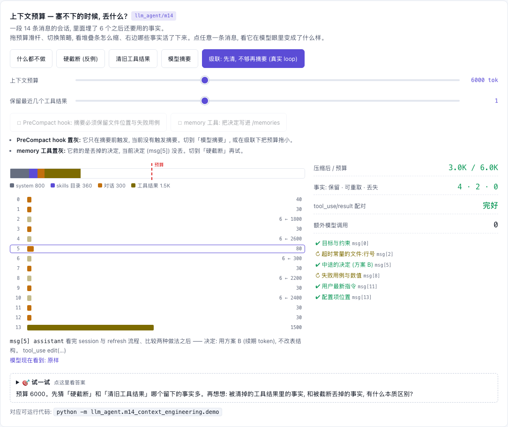

# M04 — Context & Memory

[](https://beleev.github.io#/agent/context-engineering)

[打开相关交互实验：上下文预算 — 塞不下的时候, 丢什么? llm_agent/m14](https://beleev.github.io#/agent/context-engineering)

## 直觉

Agent 每次调用模型都要重发整个上下文, 长会话既贵又迟早撑爆窗口。
最省事的做法是"爆了再截断", 但会话最早的几句话往往是用户的目标, 一刀下去 agent 从此答非所问。
所以瘦身要分档: 先做便宜且不伤结构的 (旧工具结果是上下文里最胖、最快过时的部分), 不够再花一次模型调用写摘要, 硬截断只作最后手段。
记忆解决的是另一半问题: 跨会话的稳定信息 (偏好、约定) 不该靠对话历史携带, 而是放在文件里, 用到时检索进来。

## 核心原理

### 核心数据结构与控制流

- `core/memory.py: FileMemory` — 记忆就是目录下的 markdown 文件 (可读、可改、可进版本库)。`add(title, body)` 写文件; `search(query, limit=3)` 按 query 与全文的 token 集合交集大小打分。
- `core/utils.py: tokenize` — 英文按 `[a-z0-9]+` 取词, 中文按字符 bigram (`风格回答` -> `风格 / 格回 / 回答`)。中文没有空格, 只认英文词会让中文查询得分恒为 0。
- `core/memory.py: memory_messages` — 每轮按当前 prompt 现查, 拼成 `name="memory"` 的 system 消息, 不写进 transcript: 记忆文件改了, 下一轮立刻生效。
- `core/memory.py: total_chars` — 预算的度量单位: 各消息 `text` 的字符数之和。
- 三个档位:

```
超预算?
  |
  1. clear_tool_results(messages, keep_last=1)     零模型开销; 结构无损
  |    只保留最近 keep_last 个 tool_result 的正文, 其余 content -> "[cleared: N chars]"
  |    返回新列表, 原 transcript 不动 (只改"发给模型的视图")
  |  还超?
  2. summarize_with_llm(llm, old, keep)            一次模型调用; 有损
  |    在旧消息后追加 "[compact] ..." 的 user 消息让模型写摘要
  |    产出一条 name="compact_summary" 的 system 消息, 替换旧轮次, 当前轮原样保留
  |
  3. truncate_messages(messages, max_chars)        反例基线
       头 2 条 + 尾 2 条按字符裁剪, 中间每条只留 32 字符拼成一行, 预算用完就切
```

关键设计:

- 清理时保留 `tool_result` block 本身, 只换 `content`: `tool_use / tool_result` 的配对不被破坏, 视图仍可直接发给真实 API; 占位符里的字符数也告诉模型"这里曾有数据, 需要可以重新取"。
- `keep` 参数来自 pre_compact hook: 由人指定"摘要里必须留下什么", 不把关键约束的去留交给摘要模型自行决定。
- 摘要只替换"当前用户轮之前"的历史 (`core/agent.py: Agent._compact` 在最后一条 `is_user_prompt` 处切开), 所以不会把一对 `tool_use / tool_result` 切成两半。
- 本模块只在函数层面对比三者。它们如何接进 loop (`Agent._assemble_context`)、如何让持久化的会话真的变小, 见 m14。

## 运行

上下文窗口是稀缺资源: 本模块演示文件记忆的检索, 以及上下文瘦身由便宜到贵的三个档位 (清工具结果 / 模型写摘要 / 硬截断反例)。

## 运行后应该看到什么

```bash
cd <仓库根目录> && python3 -m llm_agent.m04_context_memory.demo
```

```
[1] 文件记忆检索 (含中文查询)
  permission shell        : ['permissions.md']
  应该用什么风格回答               : ['回答风格.md']

[2] 第 1 档: 清旧工具结果 —— 零模型开销, 对话结构原样保留
  字符数                     : 3993 -> 1230

[3] 第 2 档: 模型写摘要, 替换掉旧轮次 (保留当前轮)
  [compact summary of 36 messages]
  目标: 目标1: 检索主题 1; 目标2: 检索主题 2; ... 目标9: 检索主题 9
  已完成: search_docs(topic 1); search_docs(topic 2); ... search_docs(topic 9)
  关键结果: 主题 1 的结论是 fact-1; 主题 2 的结论是 fact-2; ... 主题 9 的结论是 fact-9
  保留: 用户偏好中文
  字符数                     : 3993 -> 952

[4] 反例: 同等预算下硬截断 —— 每条消息留个开头, 预算用完就一刀切
  字符数                     : 3993 -> 896
  丢失的结论                   : [6, 7, 8, 9]
```

断言验证的内容:

- [1] 英文查询首个命中是 `permissions.md`; 中文查询 `应该用什么风格回答` 首个命中是 `回答风格.md` (靠 bigram `风格`、`回答`)。
- [2] 字符数降到原来的 40% 以下; `validate_transcript(cleared) == []`; 只有最近一个结果 (`fact-10`) 保留正文; 原 `messages` 里的 `fact-1` 仍在, 即清理没有改动 transcript。
- [3] 压缩后小于原来的 50%; 配对仍合法; 9 个旧轮次的"目标 i"和"fact-i"全部出现在摘要里; pre_compact 指定的 `用户偏好中文` 被保留。
- [4] 给硬截断与摘要相同的字符预算, 它丢掉了结论 6-9; 结果里没有任何 `tool_use` block, 只剩文本碎片。

为什么丢的是 6-9 而不是随机几条: 中间消息按顺序各留 32 字符拼接, 预算在第 6 轮附近用完后整体切掉。丢什么由位置决定, 与重要性无关。另外, 截断后的列表也能通过 `validate_transcript`, 但那是因为所有 block 都被拍平成了纯文本 (尾部那条 user 消息其实是工具输出), 结构信息已经不存在了。

## 与真实系统的差距

- 预算按字符数 (`total_chars`) 计, 不是 token。真实系统用 tokenizer 或 API 的 token 计数接口; 中英文、代码的字符 / token 比差别很大。
- `RuleBasedLLM._summarize` 是按结构抽取 (用户 prompt 原文、`tool_use` 名字加参数前 30 字符、助手结论前 60 字符), 不是真正的摘要: 它不会遗漏也不会编造。真实模型写的摘要两样都可能发生, 这才是 `keep` 和"先做无损档"的意义所在。
- 记忆检索是 token 集合交集计数: 没有 IDF、没有长度归一、没有向量语义, 命中即返回整个文件。bigram 对中文召回尚可, 但精度低 (`回答` 这类高频 bigram 到处命中)。检索质量见 m08。
- Claude Code 的 CLAUDE.md 是在会话开始时整体载入上下文, 不是按 prompt 检索; 这里的 `FileMemory.search` 更接近一个小型 RAG。模型主动读写记忆 (memory tool) 见 m14。
- 没有考虑 prompt cache: 清理或摘要都会改动上下文前缀, 使缓存失效。真实系统要权衡"省下的 token"和"丢掉的缓存", 因此通常不是每轮都清, 而是超过阈值才批量清。
- `FileMemory.add` 同名 (或清洗后同名) 标题直接覆盖, 没有并发写保护, 也没有记忆的过期与冲突处理。

## 常见误区

- "上下文窗口够大就不用管理。" 每次调用都重发全部上下文, 成本随轮数累加; 而且无关内容越多, 模型越容易忽略真正重要的早期指令。窗口大只是推迟问题。
- "清理工具结果会破坏对话记录。" `clear_tool_results` 返回新列表, 只影响发给模型的视图; 完整 transcript (以及 m06 的 JSONL) 保持原样, 审计和恢复不受影响。
- "摘要是无损压缩。" 摘要是有损的, 而且损失了什么事后看不出来。所以顺序是先清工具结果 (结构无损), 再摘要, 并用 `keep` 钉住不能丢的信息; 记忆文件则让关键信息根本不依赖对话历史。

## 自测题

1. `clear_tool_results` 为什么把旧结果换成占位符, 而不是直接删掉那条 user 消息?

<details><summary>答案</summary>
每个 assistant 的 `tool_use` 必须在下一条 user 消息里有同 id 的 `tool_result`, 删掉消息就留下了孤儿 `tool_use`, 真实 API 会拒绝整个请求 (demo 用 `validate_transcript(cleared) == []` 验证)。保留 block 只换 `content`, 结构完整, 模型还能看到"这一步做过、结果有 N 个字符", 需要时可以重新调用工具取回。
</details>

2. 同样约 900 字符的预算, 为什么摘要保住了全部 9 个结论, 硬截断却丢了 4 个?

<details><summary>答案</summary>
摘要按信息的价值分配预算: 每轮只留目标、调用名和结论, 几百字符的 `padding` 工具输出整体丢弃。硬截断按位置分配预算: 每条消息留开头 32 个字符 (工具结果的开头恰好全是 padding), 顺序拼接到预算用完为止, 后面的轮次整体消失。它不知道哪些字符重要, 还把 content block 拍平成文本, 连"这是工具结果"这一结构信息都丢了。
</details>

3. 为什么记忆是每轮现查并以 system 消息拼进上下文, 而不是查到后写进 transcript?

<details><summary>答案</summary>
写进 transcript 的内容会被永久携带、被持久化、被后续压缩反复处理, 而且记忆文件更新后旧副本仍留在历史里, 造成新旧冲突。每轮按当前 prompt 现查 (`memory_messages`), 上下文里只有与本轮相关的片段, 文件一改下一轮立即生效, transcript 也保持为"真实发生过的对话"。代价是每轮多一次检索, 以及记忆内容要占用当轮预算 (`Agent._assemble_context` 会先从预算里扣掉它)。
</details>
