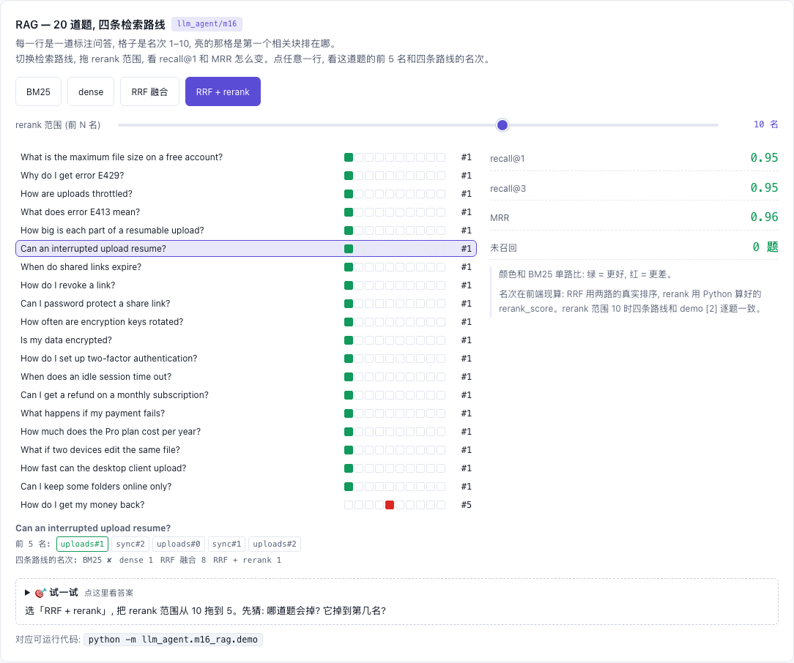

# M16 — RAG: 切块、BM25、稠密向量、RRF 混合、rerank

[](https://beleev.github.io#/agent/rag)

[打开相关交互实验：RAG — 20 道题, 四条检索路线 llm_agent/m16](https://beleev.github.io#/agent/rag)

## 直觉

m08 的文档一篇就是一句话。真实文档有几千字, 整篇塞回上下文既贵又稀释注意力, 所以要切块。切法决定检索的上限:
- 一刀切在句子中间, 答案就不在任何一块里。
- 标题和它的段落被切开, 只出现在标题里的关键词就帮不上忙。

召回也不能只靠一路, 两路的盲区不同:
- **词面匹配 (BM25)**: 对错误码 `E413` 这种罕见精确词极准, 但 `resume` 找不到 `resumes / resumable`。
- **向量检索**: 能接住拼写变体, 但罕见精确词在向量里被一堆字符片段稀释。

所以做混合。两路分数尺度不同 (BM25 没有上界, 余弦在 [-1, 1], 没法直接相加), RRF 只看名次来融合。

融合会把"只有一路召回"的正确答案排得很靠后。于是再用一个更贵、更准的打分器, 只对前 10 名重排。

最后, 没有评测集, 以上每一步"升级"都只是感觉。

## 核心原理

### 核心数据结构与控制流

全部在 `m16_rag/demo.py`:

| 环节 | 符号 | 做什么 |
|---|---|---|
| 切块 | `fixed_chunks` / `structural_chunks` | 定长 30 词、重叠 10 词; 或按 `##` 小节切, 每块前缀 `文档 > 小节` |
| 稀疏 | `BM25` | 复用 `core/utils.py: tokenize`, idf 与 m08 同款, 加 tf 饱和 `k1` 和长度归一化 `b` |
| 稠密 | `char_ngrams` / `DenseIndex` | 字符 3-gram → crc32 哈希到 4096 桶 → ±1 随机投影到 128 维 → L2 归一化 |
| 融合 | `rrf` | `Σ 1/(60 + rank)` |
| 重排 | `rerank_score` / `reranked` | 查询实词覆盖率 + 相邻实词在块里按原顺序出现 (短语); 只对 top-10 |
| 评测 | `QA` / `evaluate` / `metrics` | 每题给一段标准答案原文; 块里完整包含这段原文才算相关, 所以两种切法可以同尺比较 |
| 接入 | `RagSearchTool` | `name = "search_docs"`, 与 m08 同 schema; `untrusted_output = True` |
| 路线表 | `routes` | tfidf (直接复用 `core/retrieval.py: TfidfIndex`) / bm25 / dense / hybrid rrf / hybrid+rerank |

```
query ─┬─ BM25.rank ──────┐
       └─ DenseIndex.rank ─┴─ rrf ─ 前 10 ─ rerank_score 稳定排序 ─ 前 k ─ search_docs 输出 "[chunk_id] 文档 > 小节\n正文"
```

### 公式

```
BM25(q, d) = Σ_{w∈q} idf(w) · tf(w,d)·(k1+1) / (tf(w,d) + k1·(1 - b + b·|d|/avgdl))      k1=1.5, b=0.75
idf(w)     = ln(1 + (N - df + 0.5) / (df + 0.5))
dense(x)   = normalize( Σ_{g∈3grams(x)} (1+ln tf_g)·idf_g · R[crc32(g) mod 4096] )       R: 4096×128 的 ±1 矩阵, 种子 0
RRF(d)     = Σ_{路线 r} 1 / (60 + rank_r(d))
rerank     = 覆盖率 + 0.5 · 短语率        覆盖率 = 命中的查询实词 / 查询实词数 (前 5 个字母相同算命中)
                                         短语率 = 相邻查询实词在块里 2 个词以内按顺序出现的比例
recall@k   = 相关块进了前 k 的题数 / 总题数;   MRR = mean(1 / 第一个相关块的名次), 没召回记 0
```

关键设计:

- **结构切块带标题路径**: `How are uploads throttled?` 里的 `uploads` 只出现在文档标题里, 定长块拿不到它。
- **稠密向量用字符 n-gram**: 前提是纯 stdlib、没有训练数据。在这个前提下, 只有它能在玩具规模上显出"比词面匹配更宽容"。随机投影只做降维 (Johnson–Lindenstrauss: 内积近似保持), 不增加任何语义。
- **crc32 而不是 `hash()`**: Python 的字符串哈希每个进程随机加盐, 用它结果不可复现。
- **RRF 的 k=60**: 原论文的常用值; k 越大, 名次差异被压得越平。
- **rerank 只看 top-10**: 它是 O(|q|·|块|) 的逐对比较。真实的 cross-encoder 每对要跑一次模型前向, 所以只能用在少数候选上。

## 运行

在 m08 (TF-IDF, 一句话一篇) 的基础上做完整的检索管线:
- 结构化切块 → BM25 与稠密向量两路召回 → RRF 融合 → 只对 top-10 做 rerank。
- 用 20 道带标注的问答量 recall@k 和 MRR。
- 最后以同名工具 `search_docs` 接进 agent loop。

全部纯 stdlib。

## 运行后应该看到什么

```bash
cd <仓库根目录> && python3 -m llm_agent.m16_rag.demo
```

```
[1] 切块: 定长+重叠 vs 按标题结构 (同一条 hybrid+rerank 管线, 同一套问答)
  fixed 30w / overlap 10  : 16 块, recall@1=0.75  recall@3=0.90  MRR=0.83
  structural (## 小节)      : 15 块, recall@1=0.95  recall@3=0.95  MRR=0.96
    定长块: 'per-file limit to 50 GB. Files larger than the limit are rejected with error E413. ## Resuma'
    结构块: 'Uploads > Throttling\nWhen one account sends more than 300 requests per minute, the API start'

[2] 五条检索路线 × 20 道标注问答 (结构切块), 名次 0 = 没召回
    tfidf (m08)    recall@1=0.75  recall@3=0.90  MRR=0.81  名次=[2, 1, 3, 1, 1, 0, 1, 3, 1, 1, 1, 1, 1, 1, 1, 1, 1, 1, 1, 0]
    bm25           recall@1=0.75  recall@3=0.90  MRR=0.82  名次=[2, 1, 3, 1, 1, 0, 1, 2, 1, 1, 1, 1, 1, 1, 1, 1, 1, 1, 1, 0]
    dense          recall@1=0.85  recall@3=0.95  MRR=0.90  名次=[1, 1, 1, 3, 1, 1, 1, 1, 1, 1, 1, 1, 1, 1, 1, 1, 1, 2, 1, 5]
    hybrid rrf     recall@1=0.80  recall@3=0.90  MRR=0.87  名次=[1, 1, 2, 2, 1, 8, 1, 1, 1, 1, 1, 1, 1, 1, 1, 1, 1, 1, 1, 5]
    hybrid+rerank  recall@1=0.95  recall@3=0.95  MRR=0.96  名次=[1, 1, 1, 1, 1, 1, 1, 1, 1, 1, 1, 1, 1, 1, 1, 1, 1, 1, 1, 5]

[3] 两路各有盲区
    Can an interrupted upload resume?          bm25=0  dense=1  hybrid rrf=8  hybrid+rerank=1
    What does error E413 mean?                 bm25=1  dense=3  hybrid rrf=2  hybrid+rerank=1
    How fast can the desktop client upload?    bm25=1  dense=2  hybrid rrf=1  hybrid+rerank=1
  同义改写                    : 'How do I get my money back?' → 各路名次 [0, 0, 5, 5, 5]

[4] 接进 agent loop: 工具名仍是 search_docs
  [m16] tool_result toolu_0001 -> [uploads#1] Uploads > Resumable uploads Large uploads are split into 8 MB parts. If the...
```

断言验证的内容:

- [1] 结构切块的 MRR 比定长切块高 0.1 以上, recall@3 不低于定长。
- [2] hybrid+rerank 对比其他路线:
  - recall@1 和 MRR **严格**高于 tfidf / bm25 / dense 每一条单路, recall@3 不低于任何单路。
  - MRR 高于不带 rerank 的 hybrid rrf。
- [3] `resume` 题 BM25 没召回 (0)、dense 排第 1; RRF 把它压到第 8, rerank 捞回第 1。`E413` 题 BM25 第 1、dense 排第 3。同义改写题没有任何路线排第 1。
- [4] agent 调 `search_docs` 返回的第一块是 `uploads#1`, 最终回答包含答案原文。

## 与真实系统的差距

- **"稠密向量"不懂语义**: 它只衡量拼写像不像。这里的 dense 更准确的名字是"压缩后的字符 n-gram TF-IDF"。
  - `How do I get my money back?` 和 `refunded` 没有共同的字符片段, 所有路线都排不到第 1。
  - 真实神经 embedding 在大语料上训练过, 能把 money back 和 refund 放到相近的位置, 也能跨语言。
- **评测集是作者自己写的 20 题**:
  - 刻意包含了词形变化 (`throttled / throttling`、`resume / resumes`)、罕见精确词 (`E413`) 和一道同义改写。
  - dense 在这里胜过 BM25, 主要是因为题目里词形变化多。换一批以精确术语为主的问题, 结论可能反过来。
  - 20 题的差异 (1 题 = 0.05) 没有统计显著性。
- **rerank 自带粗糙词干 (前 5 个字母)**: 它和 dense 捕捉的是同一类信号。所以 rerank 的收益部分来自"又做了一次词形归并"。真实 reranker 是 cross-encoder 或 LLM, 看的是 query 与块的联合语义。
- **recall@3 打平**: hybrid+rerank 与 dense 同为 0.95, 唯一没进前 3 的就是同义改写题。混合检索解决不了两路都不懂的问题。
- **切块很理想**: 文档是干净的 Markdown, 每个小节很短。真实文档有表格、代码块、超长小节。结构切块之后通常还要按长度再切, 并处理父子块、元数据过滤。
- **全量扫描**: 每次查询对每块都算一遍, O(N)。规模上去要倒排索引 (BM25) 和 ANN 索引 (HNSW / IVF)。
- **没有"找不到就说不知道"**: 永远返回前 k 块, 没有分数阈值。
- 标记为不可信只在配了 `Guardrails` 时生效, 本 demo 的 agent 没配 (见 m12)。

## 常见误区

- **"上了向量检索就不需要 BM25。"** 看 [3] 的 `E413`: 罕见精确词在 BM25 里 idf 极高, 一击即中; 在向量里被几十个字符片段平均掉, 只排第 3。生产系统普遍做混合检索, 就是因为两路盲区不同。
- **"融合一定比单路好。"** [2] 的 hybrid rrf 在 MRR 上 (0.87) 反而输给 dense 单路 (0.90)。只有一路召回的正确答案, RRF 分数只有一半, 会被两路都"还行"的块挤到后面 (`resume` 题排到第 8)。融合之后要有 rerank, 或者给各路加权。
- **"rerank 能找回漏召回的文档。"** rerank 只重排它拿到的 top-10, 召回阶段没进来的它看不见。它提升的是名次 (recall@1、MRR), 不是 recall@10。

## 自测题

1. 定长切块时, `What does error E413 mean?` 的标准答案 `rejected with error E413` 在哪个块里? 为什么结构切块对 `How are uploads throttled?` 更友好?

<details><summary>答案</summary>

就在 [1] 打印的那个定长块里: `...rejected with error E413. ## Resuma`。原文完整落在这一块, 但块尾已经切进了下一节的标题。

答案原文能不能完整落进某一块, 取决于切点。重叠 10 个词能降低被切断的概率, 但不能保证。

定长块是按词数切的。标题行 `## Throttling` 可能和下一段落分在不同块。

结构切块给每块加了 `Uploads > Throttling` 前缀。查询里的 `uploads` 只在文档标题里出现, 只有带了标题路径的块才能用上它。

</details>

2. RRF 为什么只用名次不用分数? 这个设计在 `resume` 题上带来了什么副作用?

<details><summary>答案</summary>

BM25 分数没有上界, 余弦在 [-1, 1], 两者直接相加会被 BM25 主导; 名次在两路之间可比。

副作用是 RRF 不知道"dense 对这一块有多确定":
- BM25 对这题 0 命中, 只返回有分数的块, 正确块只从 dense 一路拿到 1/61。
- 几块在两路都排 3–6 名的块各拿两份分数, 反超到前面, 正确块掉到第 8。
- rerank 逐对看 query 与块, 把它重新排到第 1。

</details>

3. 要把本模块的 dense 换成真正的神经 embedding, 需要改哪里? 换完之后同义改写题会怎样?

<details><summary>答案</summary>

只需替换 `DenseIndex.embed` 和建索引时的 `_project` (改成调用 embedding 模型, 返回稠密向量)。`rank`、`rrf`、`reranked`、`RagSearchTool` 和 agent loop 都不用动。

神经 embedding 在大语料上见过 "get my money back" 与 "refund" 的共现, 预期能把 billing#1 排进前几名。但这需要用同一套 `QA` 实测, 不能假设。

</details>
