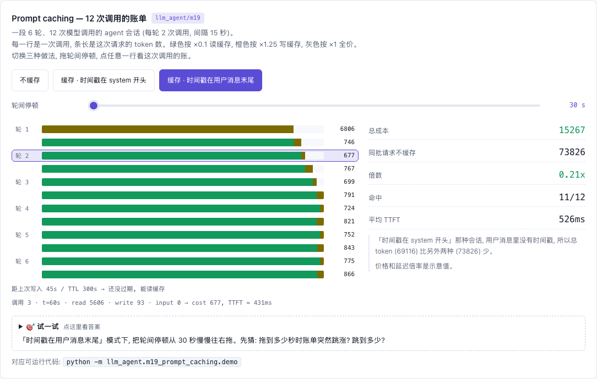

# M19 — Prompt caching: 前缀逐字节相同才命中

[](https://beleev.github.io#/agent/prompt-caching)

[打开相关交互实验：Prompt caching — 12 次调用的账单 llm_agent/m19](https://beleev.github.io#/agent/prompt-caching)

## 直觉

agent loop 每一轮都把整个上下文重发给模型 (m04 / m14)。几千 token 的 system prompt 和工具定义, 12 次调用就付 12 次全价, 也 prefill 12 次。

这些前缀每次都一样, 服务端完全可以把算好的 KV 缓存下来。prompt caching 就是这件事:
- 你在请求里标出断点。
- 服务端把"到这个断点为止的整个前缀"缓存起来。
- 下次前缀一字不差, 就直接读。

"一字不差"是关键, 也是最常见的坑。在 system 开头插一行"当前时间: 09:00:15", 前缀每次都变, 一次也命中不了。而每次都按写入价 (×1.25) 计费, 比不开缓存还贵。

治法是一条排版规则: 稳定的放前面, 易变的放后面。

## 核心原理

### 核心数据结构与控制流

全部在 `m19_prompt_caching/demo.py`。请求体转换复用 `core/claude_llm.py: to_api_messages` (m15), 工具顺序复用 `core/tools.py: ToolRegistry.schemas()` 的排序。

| 部分 | 符号 | 做什么 |
|---|---|---|
| 请求序列化 | `request_blocks` | tools (每个一个 block) → system → messages 的每个 content block; `json.dumps(sort_keys=True)` 保证同内容同字节 |
| 缓存 | `PromptCache.request` | 前缀哈希链; 从每个断点往回最多看 20 个 block 找已缓存前缀; 取最长命中; 命中刷新 TTL; 断点处写入新条目 |
| 计费 | `bill` | `(input, write, read)` → 费用 与 TTFT |
| 会话 | `RecordingLLM` / `session` | 用 `core` 的 `Agent + RuleBasedLLM` 跑 6 轮检索, 记录每次调用的上下文和模拟时钟 (每次调用 15s) |
| 回放 | `replay` | 同一批调用分别按不缓存 / 缓存计费; `timestamp_in_system=True` 在 system 开头现拼时间戳 |

断点放两处:
- **system 末尾**: 静态部分, 保底的读点。
- **最后一个 block**: 对话增量。

下一次请求里, "上一次最后一个 block" 落在新请求断点往回 20 个 block 之内, 所以能读到。

```
request = [tool_1 .. tool_n | system | msg_1 .. msg_k]
                            ^bp1                   ^bp2
hash_i  = sha256(block_0 .. block_i)                     任何一个字节变了, 之后的哈希全变
hit     = max{ i+1 : i ∈ [bp-19, bp], entries[hash_i] 未过期 }   对每个断点
read    = tokens(block_0 .. block_{hit-1})
write   = tokens(block_hit .. block_{bp2})                并把 hash_bp1、hash_bp2 写入, 过期时刻 = now + TTL
input   = tokens(bp2 之后)                                本 demo 断点在最后一个 block, 恒为 0
```

### 公式

```
cost  = input·1.0 + write·1.25 + read·0.1                      (单位: 基础输入单价 × token)
ttft  = 300ms + (input + write)·0.20ms + read·0.02ms           (示意 prefill 模型: 写入也要完整 prefill)

盈亏平衡 (5 分钟 TTL): 同一前缀用 2 次, 缓存 1.25 + 0.1 = 1.35 < 不缓存 2.0
                        只用 1 次, 缓存 1.25 > 不缓存 1.0  —— 冷写比不开缓存贵 25%
```

## 运行

模拟 Messages API 的 `cache_control` 断点:
- 按 tools → system → messages 拼出请求, 按前缀哈希查缓存。
- 写入 ×1.25、读取 ×0.1、TTL 5 分钟。

用一个 6 轮、12 次模型调用的 agent 会话, 比较三种情况的计费和首 token 延迟:
- 不缓存。
- 正确缓存。
- "时间戳放在 system 开头"。

**价格与延迟倍率都是示意值** (`PRICE` / `LATENCY_MS`), 实际以官方定价为准。不同模型的读取倍率不同 (多数 ×0.1, 部分新模型更低); 1 小时 TTL 的写入是 ×2。

## 运行后应该看到什么

```bash
cd <仓库根目录> && python3 -m llm_agent.m19_prompt_caching.demo
```

```
[1] 机制: 同一前缀第二次读缓存; 工具顺序一换 (字节变了) 就全部重写
  第 1 次 (冷)               : {'read': 0, 'write': 5435, 'input': 0}  cost=6794  ttft≈1387ms
  第 2 次 (同前缀)             : {'read': 5435, 'write': 0, 'input': 0}  cost=544  ttft≈409ms
  工具顺序反转                  : {'read': 0, 'write': 5435, 'input': 0}  cost=6794  ttft≈1387ms
  静默 5 分钟后                : {'read': 0, 'write': 5435, 'input': 0}  cost=6794  ttft≈1387ms

[2] 6 轮检索会话 (12 次模型调用): 不缓存 vs 缓存, 以及时间戳放错位置
    不缓存                    read=     0 write=     0 input= 73826  cost= 73826 (不缓存的 1.00x)  平均ttft≈ 1530ms  命中 0/12
    缓存 (时间戳在 system 开头)    read=     0 write= 69116 input=     0  cost= 86395 (不缓存的 1.25x)  平均ttft≈ 1452ms  命中 0/12
    缓存 (时间戳在用户消息末尾)        read= 66970 write=  6856 input=     0  cost= 15267 (不缓存的 0.21x)  平均ttft≈  526ms  命中 11/12

[3] TTL: 同样的会话, 每轮之间停 6 分钟
  每轮间隔 6 分钟               : cost=50380  命中 6/12  (间隔 30 秒时 cost=15267)
```

"不缓存的 x 倍"是和**同一批请求**不开缓存相比。

时间戳在 system 开头的那次会话, 用户消息里没有时间戳, 所以总 token 比另外两行少。它的平均 TTFT 略低于"不缓存"那一行也是这个原因, 与缓存无关。

断言验证的内容:

- [1] 单次请求:
  - 冷请求全部是写入。
  - 同前缀第二次全部是读取, 读取量等于上次写入量。
  - 工具顺序反转或过了 TTL 之后读取为 0。
  - 读取的费用不到冷写的 1/10; 冷写比不缓存贵。
- [2] 会话共 12 次调用:
  - 时间戳在 system 开头时命中 0 次, 费用超过同批请求不缓存的 1.2 倍。
  - 时间戳在用户消息末尾时只有第 1 次是冷的 (命中 11/12)。
  - 此时费用低于不缓存的 0.25 倍, 平均 TTFT 低于不缓存的 0.4 倍。
- [3] 每轮间隔 6 分钟 (超过 5 分钟 TTL): 只有每轮内的第 2 次调用能命中 (6/12)。费用介于正确缓存和不缓存之间。

## 与真实系统的差距

- **所有倍率和延迟都是示意值**: `PRICE` 与 `LATENCY_MS` 是参数, 不是实测。真实的读取倍率因模型而异, 1 小时 TTL 的写入是 ×2, TTFT 还取决于输出、负载和网络。以官方定价和 `response.usage` 为准。
- **token 是估算的**: 用 `core/utils.py: estimate_tokens` 按字符估, 不是真实 tokenizer。
- **没有最小可缓存长度**: 真实 API 对前缀有模型相关的最小长度 (几百到几千 token)。短于它的前缀静默不缓存, `cache_creation_input_tokens` 为 0。本 demo 的 system prompt 约 5000 token, 不受影响。
- **没有断点数上限**: 真实 API 每个请求最多 4 个 `cache_control` 断点; 本 demo 只用 2 个。
- **20 个 block 的回看窗口**被简化成"按 block 数"。真实 API 把连续的 tool_use / tool_result 各算一个位置。一轮追加太多 block, 会让上一次的条目落在窗口外, 每次都整段重写。
- **TTL 从请求开始算**: 真实 API 的 5 分钟从写入或读取那次请求的**开始**算, 生成时间也计入。本 demo 用离散时钟, 不区分。
- **其他隐形失效没演示**:
  - 模型切换、`tool_choice` 或 thinking 参数变化、上下文清理, 都会让缓存失效。m14 的 `clear_tool_results` 会改写历史里的 tool_result。
  - 本 demo 把 `context_budget_chars` 设得很大, 就是为了不让清理改写历史。
- **缓存隔离**: 真实缓存按组织隔离, 这里只有一个全局字典。

## 常见误区

- **"开了缓存总不会更贵。"** [2] 的时间戳反例是 1.25 倍: 每次都写、一次都读不到。缓存是用"写入溢价"换"后续读取折扣", 前缀不复用就只剩溢价。
- **"内容一样就能命中。"** 要的是**字节**一样。[1] 里工具还是那两个, 只是顺序反了, 就一个字节也读不到。
  - JSON 键顺序、工具列表顺序、空白、时间戳、请求 id, 都是隐形的失效源。
  - 这也是 `ToolRegistry.schemas()` 要排序的原因。
- **"时间戳根本不能放进 prompt。"** 可以放, 放在后面。[2] 的正确做法把时间戳跟在每轮用户消息末尾。它进入历史之后就不再变, 下一轮它已经是被缓存的前缀的一部分。错误的是每次调用都在最前面现拼一个新值。

## 自测题

1. [2] 里"时间戳在用户消息末尾"也有时间戳, 为什么它几乎每次都命中? 它唯一的那次未命中是哪一次?

<details><summary>答案</summary>

时间戳是用户提交这一轮时写进用户消息的, 之后作为历史原样重发, 字节不再变化。

每次新请求 = 上一次请求的全部 block + 新增的几个 block。所以:
- 上一次在最后一个 block 处写入的条目, 恰好是新请求的前缀。
- 这个条目在断点往回 20 个 block 之内, 所以能读到。

唯一未命中的是整个会话的第一次调用: 缓存是空的, 只能写。

</details>

2. 为什么每轮间隔 6 分钟时恰好命中 6/12, 而不是 0/12?

<details><summary>答案</summary>

每轮用户输入会触发两次模型调用, 两次相隔 15 秒 (模拟时钟):
- 第一次发出 tool_use。距上一轮已经过了 6 分钟, 超过 5 分钟 TTL, 所有条目都过期了, 整段重写。
- 第二次在拿到 tool_result 后给最终回答。它在 TTL 之内, 能读到第一次刚写的前缀。

6 轮 × 每轮 1 次命中 = 6/12。对策是缩短间隔、定时发一个只刷新缓存的请求, 或改用 1 小时 TTL (写入更贵)。

</details>

3. 断点为什么放两处 (system 末尾 + 最后一个 block), 只放最后一个行不行?

<details><summary>答案</summary>

只放最后一个, 在对话连续增长时也能命中 (靠 20 个 block 的回看)。

但有两种情况会让最后一个断点找不到任何已缓存前缀:
- 历史里某处被改写 (上下文清理、摘要压缩)。
- 一轮追加的 block 超出回看窗口。

这时连 system 和工具定义这部分最贵、最稳定的前缀也要重写。system 末尾的断点是一个保底读点: 不管 messages 里发生什么, tools + system 这一段只要不变就能读到。

</details>
