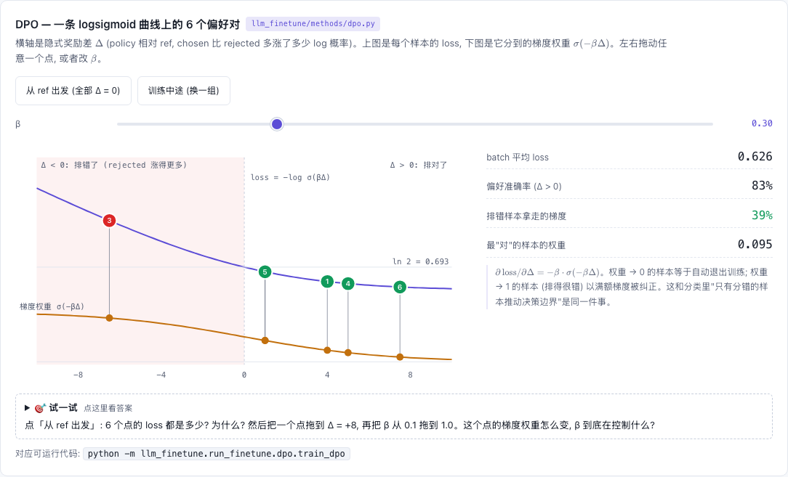

# DPO — 直接偏好优化

[](https://beleev.github.io#/finetune/dpo)

[打开相关交互实验：DPO — 一条 logsigmoid 曲线上的 6 个偏好对 llm_finetune/methods/dpo.py](https://beleev.github.io#/finetune/dpo)

## 直觉

RLHF 原本要两步, 两步都贵:
- 先用偏好对训一个 reward model (RM)。要多养一个模型, RM 打分不准时策略还会钻它的空子。
- 再用 RL 让策略去拿高分。要在线采样, 训练不稳, 超参难调。

DPO 把两步合成一步, 直接在偏好对上训策略:
- 条件是 "策略不许离 ref 太远"。ref 是训练开始时那份策略的冻结副本, 这个条件叫 KL 约束。
- 在这个条件下, 最优策略和奖励之间有一个能直接写出来的关系: 策略相对 ref 把一条回复的概率抬高多少, 就等于它认为这条回复有多好。
- 写成公式: `r(x,y) = β·log π(y|x)/π_ref(y|x) + const`。
- 把这个 r 代回 RM 的 Bradley-Terry loss (`−log σ(r_w − r_l)`, 见 [rm](../rm/README.md)), 得到一个对偏好对的二分类 loss。RM 和 RL 都不用了。

## 核心原理

### 核心公式

`L = − log σ( β·[ (log π_θ(y_w) − log π_ref(y_w)) − (log π_θ(y_l) − log π_ref(y_l)) ] )`
`log π(y|x) = Σ_{t∈回复} log p(y_t|·)`，**包含第一个回复 token**。

## 运行

```bash
python -m llm_finetune.run_finetune.dpo.train_dpo      # ~9 s
```

## 运行后应该看到什么

起点 = SFT 100 步的 "半会" 模型; β=0.5, lr=3e-4, 200 步, 全部指标在**留出**偏好对上:

| 留出集 | 偏好准确率 | log π(chosen) | log π(rejected) | 贪心 exact-match |
|---|---|---|---|---|
| SFT 后 | 0.965 | −4.03 | −10.55 | 0.332 |
| DPO 后 | 0.996 | **−4.18 ↓** | −15.36 | **0.137 ↓** |

第 1 步 loss 恰为 0.6931 = ln 2 (policy = ref)。
**怎么读这张表**:
- 偏好准确率上去了, chosen 与 rejected 的差值从 6.5 拉到 11.2。
- 但 chosen 自己的 log-prob 也掉了, 生成质量 (EM) 反而下降。
- 原因: DPO 的 loss 只看差值, "两边一起降、rejected 降得更多" 同样让 loss 变小。这个现象叫 likelihood displacement, 脚本对它设了断言。
- 对照 `simpo_orpo`: ORPO 的 NLL 项正是为此而设。

训练走通用 `Trainer`: `PairwiseForward.with_frozen_copy(policy)` 把 "policy 前向 + ref 前向" 包成一个 Module; 没有 DPOTrainer, 没有复制的训练循环。

## 与真实系统的差距

- **偏好对是程序造的**: rejected 只比 chosen 错一个或少一个 token。真实偏好对里两条回复可能整体不同, 标签还带噪声。
- **起点故意只训到 "半会"**: SFT 100 步, EM 0.332, 为的是留出提升空间。真实 DPO 的起点是已经训好的 SFT 模型。
- **只跑了一组超参**: β=0.5、lr=3e-4、200 步。likelihood displacement 在别的 β 和步数下有多严重, 脚本没有测。
- **ref 的 log-prob 每步现算**: 这里每步换新 batch, 只能现算。数据集固定时可以把 ref 的 log-prob 预先算好存下来, 训练时就不用常驻第二份权重。
- **只量了偏好准确率和 EM**: 真实对齐要看回复质量的人评或基准集, 留出集上 "chosen 概率高于 rejected" 只是必要条件。
- **未实现 IPO**: 它改的是 loss 的形状, 用来防止差值被无限拉大。

## 常见误区

- **prompt mask 多盖一位**, 并辩称 "那一步转移对 chosen / rejected 相同"。上下文相同, 但**目标 token y₁ 不同**, log p(y₁|x) 恰恰是区分两者的一项。
- 以为 reward margin 变大 = 模型变好。要同时盯 `logp_chosen`。
- ref 被注册成子模块: 会进 optimizer、被 `.train()` 切模式。这里故意放在 tuple 里。
- β 越大越 "用力"? 相反: β 大 → σ 更快饱和 → 梯度更早消失 → 更贴近 ref。

## 自测题

1. 为什么第 1 步 loss 一定是 ln 2? — policy = ref ⇒ 两个 log-ratio 都是 0 ⇒ −log σ(0)。
2. DPO 每步比 SFT 多多少计算? — 序列数 ×2 (chosen + rejected), 再加一次不带梯度的 ref 前向; 常驻权重 ×2。
3. loss 在降而 chosen 的概率也在降, 可能吗? — 可能, 只要 rejected 降得更快。上表就是。
