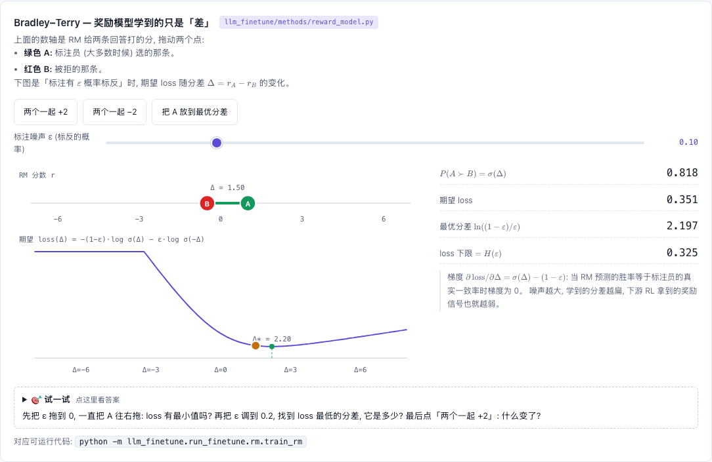

# Reward Model — 把 "A 比 B 好" 变成标量分

[](https://beleev.github.io#/finetune/rlhf-grpo-distill)

[打开相关交互实验：Bradley–Terry — 奖励模型学到的只是「差」 llm_finetune/methods/reward_model.py](https://beleev.github.io#/finetune/rlhf-grpo-distill)

## 直觉

人只能稳定地标相对偏好, 在线 RL 却需要一个能随时调用的标量奖励。RM = LM 主干 + 标量头, 读完整条 (prompt, 回复) 后打分。

## 核心原理

### 核心公式

`P(y_w ≻ y_l) = σ(r_w − r_l)`，`L = − log σ(r_w − r_l)`；`r = value_head(h[最后一个非 pad token])`。只有分差有意义。

## 运行

```bash
python -m llm_finetune.run_finetune.rm.train_rm        # ~9 s
```

## 运行后应该看到什么

偏好对 = (正确排序, 损坏的排序); 损坏 = 改错一个 token 或漏掉一个 token (后者变短 → batch 里有右 pad)。

| | 数值 |
|---|---|
| 第 1 步 loss | 0.6929 (≈ ln 2) |
| **留出集**偏好准确率, 300 步 | 0.549 → **0.930** |
| 同一序列右侧多垫 5 个 PAD: 取最后一个真 token | 分数偏移 5e-06 |
| 同上, 不传 mask, 取 `scores[:, -1]` (读到的是 pad 位置) | 分数偏移 **4.54** |

训练走的是通用 `Trainer`: `PairwiseForward(rm)` 把 chosen / rejected 拼成一个 batch 前向, `BradleyTerryLoss` 是普通 `LossComputer`。

## 与真实系统的差距

- **偏好对是程序造的**: rejected 是把正确排序改错或漏掉一个 token, 好坏界限分明。真实偏好由人标注, 标注员之间会不一致, 标签有噪声。
- **RM 没有接进 RL**: `ppo` 和 `grpo` 脚本的奖励是规则 verifier (`task.verify`), 没有用这个 RM。策略钻 RM 的空子拿高分 (reward hacking) 在本库里观察不到。
- **不传 mask 不会报错**: `RewardModel.forward` 在 `attention_mask=None` 时直接取 `scores[:, -1]`。batch 里有 pad 而调用方忘了传 mask, 读到的就是 pad 位置的分, 上表最后一行就是这种情况。
- **只支持右 pad**: 最后一个真 token 的下标是 `attention_mask.sum(1) − 1`。左 pad 的 tokenizer 要改这一行。
- **训练会改主干**: RM 和 policy 共用同一个 backbone 对象时, 训 RM 会把 policy 的权重一起改掉。要两用就先 deepcopy。
- **分数没有标定**: Bradley-Terry 只约束分差。拿 RM 分当 RL 奖励之前, 真实系统还要处理分数的尺度和偏移, 这里没有这一步。

## 常见误区

- 右 pad 时读 `h[:, -1]`: 那是 pad 位置的隐状态。上表最后一行。
- 手抄一遍主干前向来拿隐状态: 主干一改 (mask / RoPE / cache) 就悄悄不一致。这里用 `LLaMA.forward(..., return_hidden=True)` 直接取 `ln_f` 之后的隐状态, 复用公开的 `forward`。
- 把 RM 分数当绝对质量: Bradley-Terry 只约束分差, 整体平移不改变 loss。
- chosen / rejected 的输入格式不对称 (比如只有一边带 EOS): RM 会学到这个捷径。

## 自测题

1. 给所有分数加常数 c, loss 变吗? — 不变。
2. 为什么 RM 通常从 SFT checkpoint 初始化? — 它要先 "读懂" 回复; 主干已有的表示让偏好数据只需教会打分头。
3. 左 pad 时 "最后一个真 token" 在哪? — 就是 `[:, -1]`; 本实现假设右 pad, 用 `attention_mask.sum(1) − 1`。
