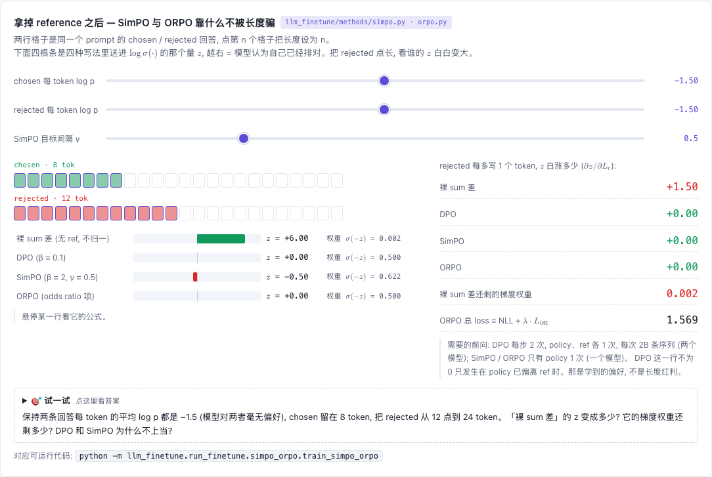

# SimPO / ORPO — 不要 reference model 的偏好优化

[](https://beleev.github.io#/finetune/simpo-orpo)

[打开相关交互实验：拿掉 reference 之后 — SimPO 与 ORPO 靠什么不被长度骗 llm_finetune/methods/simpo.py · orpo.py](https://beleev.github.io#/finetune/simpo-orpo)

## 直觉

DPO 要常驻一份 ref 并每步多一次前向。
- **SimPO**: 奖励直接取 "平均每 token 的 log-prob" (与生成时的打分一致, 且不偏爱短回复), 再要求 chosen 至少赢出 γ。
- **ORPO**: SFT loss + 一个 odds-ratio 惩罚, 一个阶段同时学任务和偏好; NLL 项充当锚, 取代 ref。

## 核心原理

### 核心公式

SimPO: `L = − log σ( (β/|y_w|)·log π(y_w) − (β/|y_l|)·log π(y_l) − γ )`
ORPO: `L = NLL(y_w) + λ·(− log σ( log odds(y_w) − log odds(y_l) ))`，`odds = p/(1−p)`，`p = exp(平均 token log-prob)`

## 运行

```bash
python -m llm_finetune.run_finetune.simpo_orpo.train_simpo_orpo   # ~25 s
```

## 运行后应该看到什么

同一个 SFT 起点 (100 步)、同样的偏好数据、各 200 步、lr=3e-4; 指标都在留出集上:

| | 偏好准确率 | log π(chosen) | log π(rejected) | 贪心 EM | LM 前向/步 | 耗时 | 常驻权重 |
|---|---|---|---|---|---|---|---|
| SFT 起点 | 0.965 | −4.03 | −10.55 | 0.332 | – | – | 389 KiB |
| DPO β=0.5 | 0.996 | −4.25 | −15.60 | 0.121 | **2** | 5.4 s | **778 KiB** |
| SimPO β=2 γ=1 | 0.992 | −5.69 | −16.90 | 0.023 | 1 | 4.0 s | 389 KiB |
| ORPO λ=0.5 | 0.988 | **−2.51** | −11.61 | **0.543** | 1 | 4.0 s | 389 KiB |
| 纯 SFT (从零, 300 步) | 1.000 | −0.32 | −14.85 | 0.973 | 1 | 3.1 s | 389 KiB |
| ORPO (从零, 300 步) | 1.000 | −0.29 | **−16.34** | 0.973 | 1 | 5.9 s | 389 KiB |

- **省了什么**: 无 ref ⇒ 前向次数减半、常驻权重减半, 实测每步快约 25% (反传仍在, 所以不是 50%)。
- **效果怎样**: 三者都提高了偏好准确率; 但 DPO / SimPO 让 chosen 的概率下降、EM 崩掉 (SimPO 没有任何锚, 最严重), 只有 ORPO 把 chosen 往上抬。
- ORPO 不需要先 SFT: 从随机初始化出发与纯 SFT 同样学会任务, 且把 rejected 压得更低 (−16.34 vs −14.85)。

## 与真实系统的差距

- **每个方法只跑了一组超参**: DPO β=0.5, SimPO β=2 γ=1, ORPO λ=0.5, 都没有调。SimPO 的 EM 0.023 是这组超参在这个任务上的结果, 不能读成 "SimPO 普遍比 DPO 差"。
- **"从零" 指随机初始化**: ORPO 论文省掉的是预训练之后的 SFT 阶段, 起点仍是预训练模型。本库没有预训练权重, 所以脚本里的 "从零" 是从随机初始化训 300 步。
- **NLL 项不是硬保证**: 它给 chosen 一个向上的梯度。λ 取大时, odds-ratio 项仍可能把 chosen 拉低。脚本只测了 λ=0.5。
- **耗时只在一种硬件上量过**: 5.4 s 和 4.0 s 是 99,648 参数的模型在 CPU 单线程上跑 200 步的数。省掉 ref 前向能快多少, 和模型大小、硬件有关。
- **偏好对是程序造的**: rejected 只比 chosen 错一个或少一个 token, 长度最多差 1。SimPO 的长度归一化要防的 "偏爱短回复", 在这份数据上几乎没有机会出现。

## 常见误区

- SimPO 沿用 DPO 的 β=0.1: 平均 log-prob 数值小得多, β 要取 2~10。
- 去掉长度归一化: 退化成 "没有 ref 的 DPO", 且 Σ_t 形式偏爱短回复。
- 以为 "无 ref = 白捡": ref 是防漂移的锚。SimPO 靠小 lr / 少步数, ORPO 靠 NLL; 什么都不靠就是上表 SimPO 那一行。
- ORPO 的 log(1−p): p→1 时要 clamp, 否则 log 0。

## 自测题

1. SimPO 的 γ=0、不做长度归一化, 它等于什么? — π_ref 取均匀分布的 DPO。
2. 为什么 ORPO 用 odds 而不是概率比? — odds 在 p→1 时发散, 对 "已经很自信的 chosen 与 rejected 的差距" 更敏感; 概率比在那里趋于平坦。
3. DPO 每步 2 次 LM 前向, 为什么实测只慢 ~35% 而不是 100%? — ref 前向不带梯度、不存激活; 训练一步的主要成本在带梯度的前向 + 反传。
