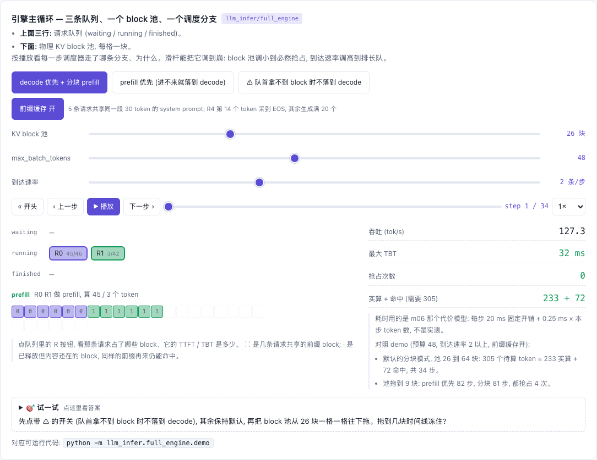

# Full Engine — 把模块接成 mini-vLLM

[](https://beleev.github.io#/infer/engine)

[打开相关交互实验：引擎主循环 — 三条队列、一个 block 池、一个调度分支 llm_infer/full_engine](https://beleev.github.io#/infer/engine)

## 直觉

前面每个模块单独解决一个瓶颈; 引擎只做一件事: 每个 step 把它们按顺序串起来 ——
**调度** (谁、算几个 token) → **前向** (KV 读写走分页 pool) → **采样** → **后处理** (登记前缀缓存、结束的还 block)。

## 核心原理

### 核心数据结构或公式

| 文件 | 职责 | 复用的模块 |
|---|---|---|
| `engine.py` | `add_request / step / generate`, 只有胶水代码 | m03 `Scheduler` (同一个类, 非拷贝), m10 `sample` |
| `model_runner.py` | 物理 KV pool `(L, num_blocks, bs, D)` + 分页前向 | m02 `write_kv / paged_attention` |
| (m02) `BlockManager` | block 记账、ref_count、LRU free_list | |
| (m04) `PrefixCache` | 链式 hash 索引, 随 block 被覆盖而失效 | |
| (m03) `Scheduler` | 连续批、抢占、`chunked_prefill` 混批 (分块是 m03 调度器的开关, 引擎不 import m06; 原理见 m06) | |

```
step():  batch = scheduler.schedule()                       # [(seq, n)]
         logits = runner.run(ids[:computed+n], block_table, start_pos=computed)   # 只算 n 个, 其余 KV 从 pool 读
         token  = sample(logits) if computed+n == num_tokens else None            # prefill 中途的 chunk 不采样
         scheduler.postprocess(batch, tokens)
对账:    Σ(每条序列 num_tokens-1) = tokens_computed + prefix_hit_tokens      (无抢占时)
```

## 运行

在仓库根目录执行：

```bash
python -m llm_infer.full_engine.demo
```

## 运行后应该看到什么

```bash
python -m llm_infer.full_engine.demo      # ~1.5 s
```
下面是节选, `...` 处省略了中间的 step。
```
[1] 5 条共享 system prompt 的请求 (block=8, 每步 token 预算 48, 分块 prefill + 前缀缓存)
  step   1 [s0:P45 s1:P3              ] tokens= 48
  step   2 [s0:D s1:P39 s2:P8         ] tokens= 48
  step   3 [s0:D s1:D s2:P12 s3:P19   ] tokens= 33
  step   4 [s0:D s1:D s2:D s3:D       ] tokens=  4
  ...
  需要 KV 的 token 总数                 = 305
  真正做了前向的 token                    = 233
  前缀命中而跳过的 token                   = 72

[2] 同样 5 条再提交一次: 上一轮的 block 已全部释放, 但内容还在 → prompt 的完整 block 全部命中, 只剩尾巴 + decode 要算
  第二轮实算 token (第一轮)                = 105 (233)

[3] KV pool 只有 9 个 block (72 token), 单条请求跑完就要 8 个 → 必然抢占
  chunked=False step / 抢占 / 实算 token = 82 / 4 / 261
  chunked=True  step / 抢占 / 实算 token = 81 / 4 / 261

[4] 同一个 batch, 每条请求自带采样参数 (m10)
  T=0.0  top_k=0     top_p=1.0   → '9^PV1111?\n$9'
  T=0.8  top_k=10    top_p=1.0   → 'y5.V,P?...P.'
  T=1.0  top_k=0     top_p=0.9   → 'f\n5Vw;9h)gSN'

[5] fuzz: 30 组随机 (block_size / pool / 预算 / 分块 / 前缀缓存) 配置, 含 id ≥ 256 的词表
  请求数 / 其中触发的抢占                    = 214 / 34
```
- [1] prefill chunk 与 decode 在同一步里混跑, 每步 ≤ 48 token。对账: 305 = 233 + 72。
- [2] 实算从 233 降到 105。命中的都是已释放、还没被覆盖的 block; 索引里没有过期项, 不会命中脏 KV。
- [3] 无活锁。调度写错时, 这里会死循环。

断言: 每一段的 greedy 输出都与 `TinyLM.generate_greedy` **逐 token 相同**, 无 block 泄漏。

## 与真实系统的差距

- 逐序列循环前向; vLLM 把 batch 摊平成一个张量 + varlen FlashAttention + CUDA Graph (m11 / m12)
- 离线同步循环; 真实引擎有异步 API server、流式输出、detokenize 线程、多进程 worker (TP, m09)
- 未集成: m05 radix cache (与 m04 二选一, 接口不同: radix 按 token 粒度匹配并自己管 LRU)、m07/m17/m19 投机解码、m08 量化
- 抢占只有 recompute, 没有 swap

## 常见误区

- "分页 / 前缀缓存只是记账" —— 如果 KV 挂在 Sequence 上、命中了照样整段 prefill, 那确实只是记账。这里 KV 只存在 pool 里, 命中的 token 不做前向
- "引擎很复杂" —— 复杂度都在调度策略与 kernel 里, 主循环就四行
- "优化会改变输出" —— 这里所有优化都是**精确**的, 所以能用逐 token 相等做回归测试 (量化 / 稀疏注意力才是有损的)

## 自测题

1. 一条序列前缀命中 24 token, prompt 共 45 token, 第一步 `runner.run` 的 `start_pos` 和 Q 的行数是多少 (预算充足)? **答**: start_pos=24, Q 有 21 行; K/V 经页表读回 45 行。
2. 为什么 prefill 中途的 chunk 返回 `None` 而不采样? **答**: 它最后一个位置的 logits 预测的是 prompt 里已知的下一个 token, 不是新 token。
3. block 不够时, 什么样的调度会让引擎死循环? **答**: `waiting` 非空就只走 prefill 分支, 队首拿不到 block 时什么都没选中就返回, running 从不 decode → block 永不释放。
