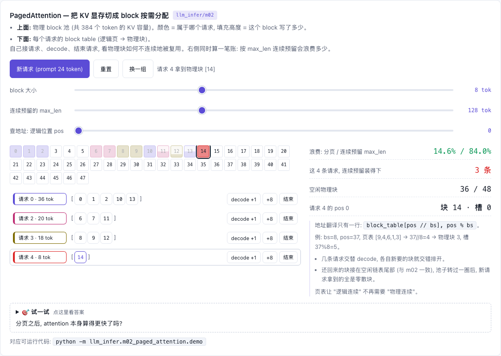

# M02 — Paged Attention: KV cache 的"虚拟内存"

[](https://beleev.github.io#/infer/kv-memory)

[打开相关交互实验：PagedAttention — 把 KV 显存切成 block 按需分配 llm_infer/m02](https://beleev.github.io#/infer/kv-memory)

## 直觉

m01 给每条序列一块连续的 KV 数组, 只能按 `max_seq_len` 预留: 实际用 100 token 却占 4096 的位置 (内碎片),
序列长短不一、结束时间不同又留下填不上的空洞 (外碎片)。vLLM 论文测得传统方案只有 20~40% 的 KV 显存装着真数据。
PagedAttention 照搬操作系统分页: KV 切成定长 block, 每条序列一张页表, 物理 block 在全局 pool 里随便放、按需要、随时还。

## 核心原理

### 核心数据结构或公式

```
block_table[seq] = [7, 2, 5]                      逻辑第 i 页 → 物理 block id
token pos 的 KV  = pool[block_table[pos // bs], pos % bs]      pool: (num_blocks, bs, D)
浪费上界         = 每条序列 < bs 个 slot (只有末页有空槽)
ref_count[blk]   > 1 ⇒ 多条序列共享同一物理 block (前缀共享, m04)
free_list        归还顺序 = 被复用顺序 = prefix cache 的 LRU 淘汰顺序; 复用前调 on_evict(blk)
```
| 文件 | 内容 |
|---|---|
| `block_manager.py` | 只记账: `allocate(seq, n, shared=[])` / `ensure_capacity` / `free` / `share_block` / `can_allocate` |
| `paged_attention.py` | 碰张量: `write_kv` (slot mapping) / `gather_kv` / `paged_attention` |

## 运行

在仓库根目录执行：

```bash
python -m llm_infer.m02_paged_attention.demo
```

## 运行后应该看到什么

```bash
python -m llm_infer.m02_paged_attention.demo
```
```
[1] 多序列并发分配 (pool=8 blocks, block_size=4)
  seq 101 block_table: [0, 1, 2]
  seq 102 block_table: [3, 4]
  seq 103 block_table: [5]
  pool 状态:           {'total': 8, 'used': 6, 'free': 2, 'utilization': '75.0%', 'n_seqs': 3}
[2] seq 102 结束, 它的 block 立即被 free_list 吃掉
  pool 状态:           {'total': 8, 'used': 4, 'free': 4, 'utilization': '50.0%', 'n_seqs': 2}
  free_list:           [6, 7, 4, 3]
[3] seq 101 增长到 13 token, 触发新 block 分配
  新分配的 block:      6
  seq 101 block_table: [0, 1, 2, 6]
[4] 申请超出 pool 容量
  MemoryError: 需要 25 个新 block, 只剩 3 个空闲
               [5] 数值验证: paged_attention 与连续 KV 计算结果一致
  max |paged - dense|              = 0.00e+00
  [6] T_q=5 (prefill chunk) max diff = 0.00e+00
  内碎片 (末页空槽)                       = 1 / 12 slot, 上界 block_size-1=3
```
- [1] 三条序列是 10 / 6 / 3 token, bs=4, 各要 3 / 2 / 1 个 block, pool 利用率 75%。
- [2] seq 102 结束后, block 4、3 回到 free_list 队尾, 排在从没用过的 6、7 后面。
- [3] 3 个 block 装满 12 个 token, 第 13 个 token 要新分配 1 个 block, 拿到的是队首的 6。
- [4] 申请 100 token 要 25 个 block, 只剩 3 个 → `MemoryError`。这是 m03 触发抢占的信号。
- [5] 是 decode 形状 (T_q=1), [6] 是一个 prefill chunk (T_q=5)。

断言: [5] [6] 两种形状下, 分页 KV 上的 attention 与连续 KV 的结果相同。

## 与真实系统的差距

- 这里 `gather_kv` 先把散落的 block 拷成连续数组再算; vLLM / FlashInfer 的 kernel 直接按页表跳着读, 零拷贝
- 真实 pool 形状是 `(num_blocks, bs, n_kv_head, head_dim)`, 每层一个, 启动时按"显存余量 × gpu_memory_utilization"一次分配
- `share_block` 从 free_list 捞 block 用的是 O(n) 的 `deque.remove`; vLLM 用双向链表 O(1)
- 没有 copy-on-write: 本库只共享写满的 block (不可变), beam search 那种共享未满 block 才需要 CoW

## 常见误区

- "分页让 attention 变快" —— 不, 单次 attention 反而因间接寻址略慢; 赚的是**显存利用率 → 更大 batch → 吞吐**
- "block 越小越好" —— 碎片少了, 但页表变长、kernel 间接访问变多; vLLM 默认 16
- "free 了 block 内容就没了" —— 只是 ref_count 归 0 进队列, 内容留到被覆盖为止, m04 正是靠这一点

## 自测题

1. bs=16, 100 条序列平均长 1000 token, 最多浪费多少 slot? **答**: 每条 < 16, 总共 < 1600 slot, 约 1.6%; 连续预留 4096 的方案浪费约 75%。
2. 为什么 `allocate` 要先 `share_block` 命中的 block, 再 pop 新 block? **答**: 命中的 block 可能 ref=0 正躺在 free_list 里, 先 pop 可能恰好把它当新 block 拿走并覆盖。
3. token 位置 37, bs=8, 页表 `[9,4,6,1,3]`, KV 在哪? **答**: 37//8=4 → 物理 block 3, slot 37%8=5。
