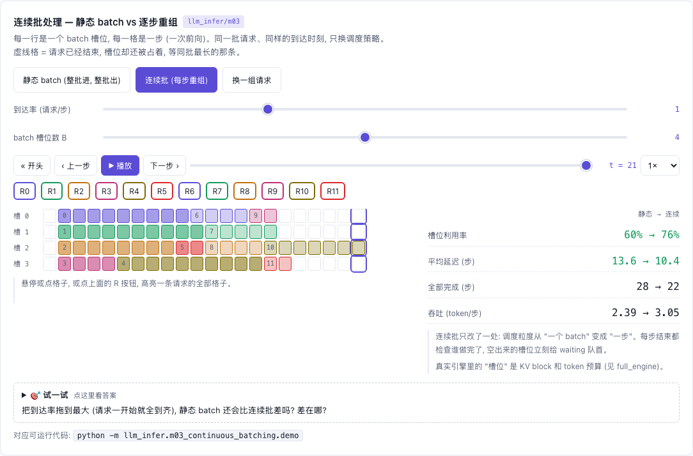

# M03 — Continuous Batching: 每一步都重新组 batch

[](https://beleev.github.io#/infer/scheduler)

[打开相关交互实验：连续批处理 — 静态 batch vs 逐步重组 llm_infer/m03](https://beleev.github.io#/infer/scheduler)

## 直觉

静态 batch 像等人齐了才发车、到终点才一起下车: 短请求陪长请求空转, 新请求在站台干等。
连续批 (Orca 的 iteration-level scheduling) 把调度粒度从"一个请求"缩到"一步前向":
每步都问一遍 —— 谁结束了 (立刻下车还 block)、谁能进来 (有 block 就上车)、block 不够踢谁 (抢占)。

## 核心原理

### 核心数据结构或公式

```
batch = [(seq, n_tokens), ...]        n>1: prefill (或一个 chunk)    n=1: decode
seq.num_computed                      KV 已就绪的 token 数; 每步 += n, 追平 num_tokens 才采样
waiting (deque, FCFS)  ⇄  running (list, 越靠后越年轻)
prefill 优先 (chunked_prefill=False):  _admit(budget)  or  _schedule_running(budget)   ← 少了这个 or 就会活锁
decode 优先 (chunked_prefill=True):    _schedule_running 之后, 剩余预算给 _admit      (m06)
抢占 (recompute): 还掉最年轻序列的全部 block, num_computed=0, 回 waiting 队首; output_ids 原样保留
```
`core/sequence.py` 是状态, `scheduler.py` 是策略; `full_engine` 直接 import 这个 `Scheduler`。

## 运行

在仓库根目录执行：

```bash
python -m llm_infer.m03_continuous_batching.demo
```

## 运行后应该看到什么

```bash
python -m llm_infer.m03_continuous_batching.demo      # mock 模型, 第 k 个输出 token 值就是 k
```
下面是节选, `...` 处省略了中间的 step。`P5` = prefill 5 个 token, `D` = decode 1 个 token。
```
[1] 宽松 pool (32 blocks × 4): 请求随到随进, 各自完成各自退出
  step  1  [s0:P5 s1:P3 s2:P7 s3:P2     ] pool= 18.8% preempt=0
  step  2  [s0:D s1:D s2:D s3:D         ] pool= 18.8% preempt=0
  ...
  step  4  [s0:D s1:D s2:D s3:D         ] pool= 21.9% preempt=0  ✓完成 [1]
  step  5  [s4:P5                       ] pool= 28.1% preempt=0
  ...
  step 11  [s2:D                        ] pool=  0.0% preempt=0  ✓完成 [2]

[2] 紧张 pool (7 blocks × 4 = 28 token): 触发抢占; 队首进不来时 running 照常 decode, 不会活锁
  step  1  [s0:P5 s1:P3 s2:P7 s3:P2     ] pool= 85.7% preempt=0
  step  2  [s0:D s1:D s2:D s3:D         ] pool= 85.7% preempt=0
  step  3  [s0:D s1:D s2:D              ] pool=100.0% preempt=1
  step  4  [s0:D s1:D s2:D              ] pool= 71.4% preempt=1  ✓完成 [1]
  step  5  [s3:P4                       ] pool= 85.7% preempt=1
  step  6  [s0:D s2:D                   ] pool= 85.7% preempt=2
  ...
  step 10  [s3:P5                       ] pool= 85.7% preempt=2
  ...
  step 17  [s4:D                        ] pool=  0.0% preempt=2  ✓完成 [4]

  总 step (宽松 / 紧张)                 = 11 / 17
  抢占次数                             = 2
  各序列被抢占次数                         = [0, 0, 0, 2, 0]
```
- [1] s1 在 step 4 完成, step 5 `s4:P5` 立刻补位, 共 11 步。
- [2] step 3 抢占 s3。step 5 它重新 prefill, `s3:P4` 是 2 个 prompt token + 2 个已生成的 token。step 6 它又被抢占。共 17 步、抢占 2 次。

断言: 每条输出恰为 `[0..max_new-1]` (不多不少不乱序), block 全部归还, 全程无空 batch。

## 与真实系统的差距

- 真实 batch 是一个摊平的 `(Σn, D)` 张量一次前向; 这里 `(seq, n)` 列表由 runner 逐条算
- vLLM 还有 swap 式抢占 (KV 换到 CPU)、优先级调度、`max_num_seqs`/`long_prefill_token_threshold` 等更多旋钮
- 接入时按"整条序列当前长度"一次性分配 block; vLLM V1 按 chunk 逐步分配
- demo 里 s3 被反复抢占 (进来 → 又被踢) 是 prefill 优先策略的真实毛病, vLLM V1 改成 decode 优先后缓解

## 常见误区

- "batch 越大越好" —— decode 是访存瓶颈, 加 batch 几乎免费; 但 prefill 是算力瓶颈, 塞进同一步会拖慢所有人 (→ m06)
- "抢占会丢结果" —— recompute 式抢占只丢 KV; token 都在, 回来把 prompt+已生成部分重新 prefill 一遍即可
- "把已生成 token 折进 prompt 再重算"看似等价, 但会让 `max_new_tokens` 重新计数: 长度必须只数 `output_ids`

## 自测题

1. 队首请求要 6 个 block, 只剩 2 个空闲, running 里有 3 条在 decode, 这一步该干什么? **答**: decode 那 3 条。直接 return 空 batch 的话 running 永不前进、block 永不释放 → 活锁。
2. 为什么抢占最年轻的而不是最老的? **答**: 最老的已经投入的计算最多, 重算代价最大; 且"最老的永远能前进"保证整体有进度。
3. `max_batch_tokens=48`, 一条 45 token 的 prompt 和一条 40 token 的 prompt 同时到, 不分块时第一步 batch 是什么? **答**: 只有第一条 (45); 第二条放不进剩余预算 3, 等下一步。
