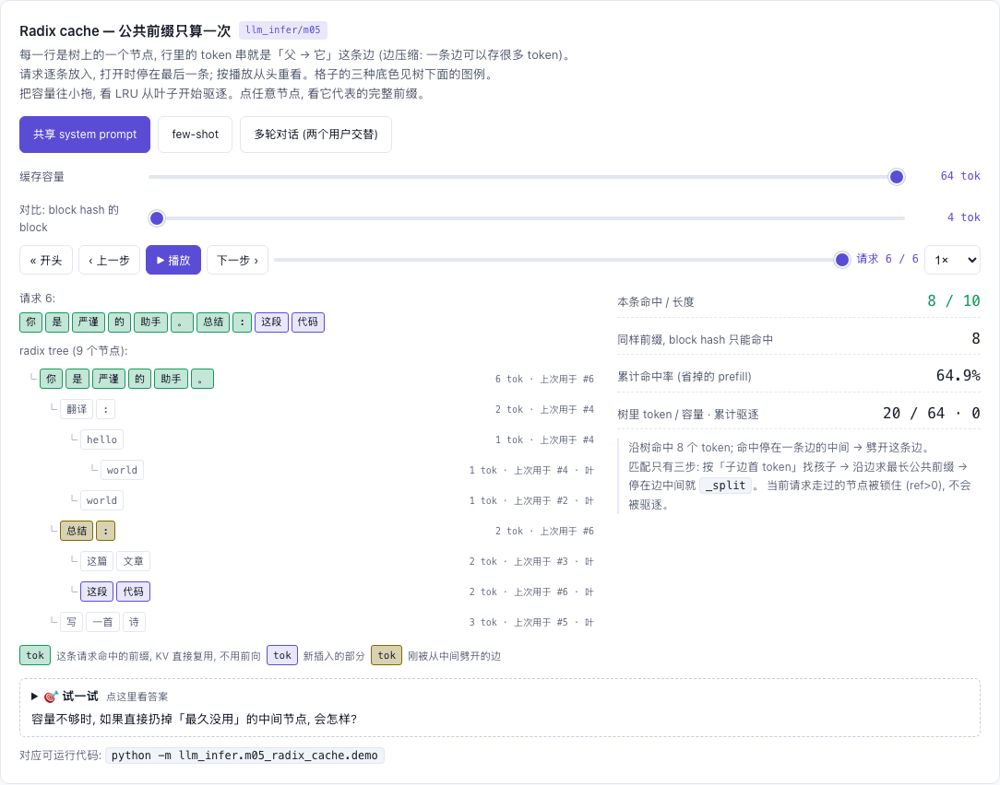

# M04 — Prefix Cache: 按 block 链式哈希复用 KV

[](https://beleev.github.io#/infer/prefix-radix)

[打开相关交互实验：Radix cache — 公共前缀只算一次 llm_infer/m05](https://beleev.github.io#/infer/prefix-radix)

## 直觉

同一个 system prompt、同一段多轮历史, 每来一条请求就重新 prefill 一遍是纯浪费 —— 因果 attention 下,
前缀的 KV 只取决于前缀本身。把"写满的 KV block"按内容哈希建索引, 新请求逐块查表, 命中的 block 直接挂进自己的页表。

## 核心原理

### 核心数据结构或公式

```
hash_i = SHA1( hash_{i-1} ‖ tokens[i·bs : (i+1)·bs] )        hash_{-1} = "<root>"
hash_to_block: {hash → 物理 block}      block_to_hash: 反向, 供失效用
命中 token 数 = 连续命中块数 × bs, 且 ≤ len-1   (至少留 1 个 token 真算, 否则没有 logits)
```
- **为什么链式**: 同样 16 个 token 接在不同前文后面 KV 不同, hash 必须带上整条前缀
- **寿命**: 序列结束 → block ref=0 进 free_list, **索引不删**; 再命中时 `share_block` 把它捞回 (ref 0→1);
  只有分配器要覆盖它时 `BlockManager.on_evict → PrefixCache.evict`。free_list 顺序天然是 LRU

## 运行

在仓库根目录执行：

```bash
python -m llm_infer.m04_prefix_cache.demo
```

## 运行后应该看到什么

```bash
python -m llm_infer.m04_prefix_cache.demo      # bs=4, pool=10
```
```
[1] A 冷启动 → 全 miss
  A 命中 token / 页表                  = 0 / [0, 1, 2, 3]
[2] B 共享 SYSTEM → 命中前 2 块, 物理 block 与 A 相同
  B 命中 token / 页表                  = 8 / [0, 1, 4, 5]
  共享 block 的 ref_count             = [2, 2]
[3] C 只有第 1 块相同 → 命中 4 token (链式 hash: 第 2 块内容不同, 后面全断)
  C 命中 token                       = 4
  占用 block: 无缓存 vs 实际              = 11 vs 8
[4] A、B、C 全部结束 → block 回到 free_list, 但内容和索引还在 → 新请求 D 照样命中
  D (= A 的 prompt) 命中 token        = 12
[5] 来一条占满整个 pool 的请求 → 旧 block 被覆盖, 索引同步失效 (不会命中到脏数据)
  pool 被占满后 A 的 prompt 命中          = 0
  索引里的 block 数                     = 10
```
- [4] 说明释放 ≠ 失效: A/B/C 全部 free 后, 同样的 prompt 仍命中 12 token。
- [5] 那条请求有 40 个 token, id 都 ≥ 256。它占满 pool 后, 被覆盖的 block 的索引已同步删除, 所以 A 的 prompt 命中 0。

## 与真实系统的差距

- 每次 `register` 从头重算 hash 链 O(T); vLLM 把每块 hash 存在 request 上增量算, 并用更快的非加密哈希
- vLLM 的 hash 还混入 LoRA id、多模态输入 hash、cache salt (多租户隔离)
- 只能命中整 block; 任意长度前缀匹配见 m05 radix tree (SGLang)
- 真正"命中就不算"的对账 (命中 + 实算 = 总 token) 在 `full_engine/demo.py`

## 常见误区

- "free 时要把缓存项删掉" —— 那样缓存只在并发请求之间有效; 正确做法是**惰性失效**: 留到 block 被覆盖那一刻
- "从不失效也行" —— block 被别人覆盖后, 索引还指着它 → 命中脏 KV, 输出悄悄错掉
- "prompt 全命中就不用 prefill" —— 还是得算最后一个 token 才有 logits, 所以命中上限是 len-1
- `bytes(token_ids)` 当哈希输入: token id ≥ 256 直接抛 ValueError, 要用定宽整数的 `tobytes()`

## 自测题

1. bs=16, 两条请求共享 100 token 前缀, 能复用多少? **答**: 6 个整 block = 96 token; 剩下 4 个 token 落在未满 block 里, 不共享。
2. 命中的 block ref_count=0 意味着什么, 该怎么处理? **答**: 它已被释放、正在 free_list 里等待复用但内容还在; 要先从 free_list 摘出来再 ref=1, 否则稍后会被当空闲块分走。
3. 为什么共享 block 不需要 copy-on-write? **答**: 只有写满的 block 才登记, 写满后不再有人写它 (新 token 写在后面的 block), 所以只读共享是安全的。
