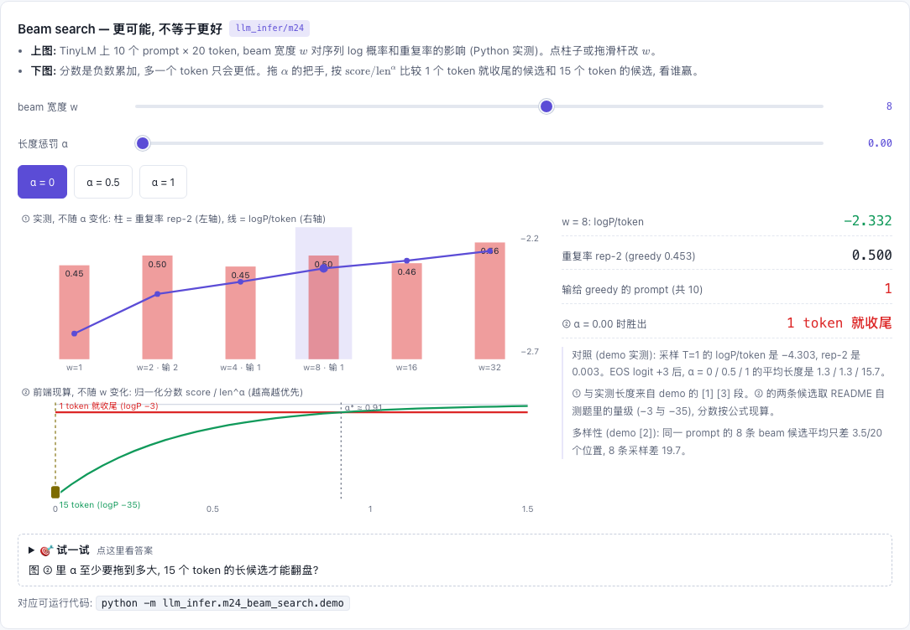

# M24 — Beam Search: 找"最可能"的序列, 以及为什么对话里不用它

[](https://beleev.github.io#/infer/decode-control)

[打开相关交互实验：Beam search — 更可能, 不等于更好 llm_infer/m24](https://beleev.github.io#/infer/decode-control)

## 直觉

greedy 每步只看眼前: 第一步选了次优 token, 后面再也回不来。可精确求 `argmax_y log P(y|x)` 要搜 V^T 条序列。

beam search 折中: 每步在 `width × V` 个候选里只留累计 log 概率最高的 `width` 条前缀。代价约 `width` 倍的 decode。

它在翻译、摘要、语音识别这类"答案基本唯一"的任务上好用。但"最可能"不等于"最好": 最可能的序列往往**短、重复、千篇一律**。
所以开放式对话默认用采样 (m10), 不用 beam。

## 核心原理

### 核心数据结构与控制流

- `beam.py:beam_search(lm, prompt, width, max_new, alpha, eos_id)`: 每条活 beam = `(累计 logp, tokens, KV, 下一步 logp)`。
  每步每条 beam 取 top-(width+1) 个 token → 全体排序 → 以 EOS 结尾且排进前 width 的收进 `finished`,
  其余依次补满 width 条活 beam, 各自 `decode_step`。结束时活 beam 也并入 `finished`,
  按 `score / len^alpha` 排序返回, `[0]` 就是输出。
- `beam.py:decode(lm, prompt, max_new, rng, eos_id)`: `rng=None` 为 greedy, 否则 T=1 采样 (m10 的 `sample`); 返回同样的累计 logp。
- `beam.py:log_softmax`。模型是 core 的 `TinyLM` (与 m19 同配置: d=64, 4 层, V=128, 随机权重)。
- `demo.py:EosBiased`: 给 EOS 的 logit 加 3.0 的包装。随机权重模型没学过何时结束 (P(EOS) ≈ 0.5%/步, 从不停)。
  加偏置后 P(EOS) ≈ 8.3%/步 (沿 greedy 路径 24 步的均值), 模拟一个会停的模型, 用来演示长度偏差。

### 公式

```
序列分数          log P(y|x) = Σ_t log p(y_t | x, y_<t)          每多一个 token 分数只会更低 (负数累加)
beam 每步         候选 = {前缀 + token}, 保留累计分 top-width
长度惩罚 (HF)     选最终答案时用 score / len^α        α=0: 原始和, 偏爱短; α=1: 平均每 token log 概率
重复率 rep-2      1 − 不同 bigram 数 / bigram 总数
```
width=1 ≡ greedy。width 增大**不保证**单调变好: 某一步 greedy 那条前缀可能排不进前 width, 被剪掉后就回不来。

## 运行

在仓库根目录执行：

```bash
python -m llm_infer.m24_beam_search.demo
```

## 运行后应该看到什么

```bash
python -m llm_infer.m24_beam_search.demo     # ~5 s (width=32 占一半)
```
```
[1] 10 个 prompt × 20 token, 不停在 EOS
               logP/token    输给 greedy 的 prompt     重复率 rep-2
  采样 T=1           -4.303                 —            0.003
  greedy           -2.620                 —            0.453
  beam w=1         -2.620                 0            0.453
  beam w=2         -2.445                 2            0.500
  beam w=4         -2.391                 1            0.447
  beam w=8         -2.332                 1            0.500
  beam w=16        -2.298                 0            0.463
  beam w=32        -2.255                 0            0.563
[2] 同一 prompt 的 8 条输出两两不同的位置数: beam w=8 = 3.5,  8 条采样 = 19.7  (满分 20)
[3] 带 EOS: EOS logit +3.0, 每步 P(EOS) 均值 0.5% → 8.3% (greedy 路径 24 步); max_new=24, 看输出长度
  greedy                           = 平均 11.4 token
  采样 T=1                           = 平均 13.1 token
  beam w=8, α=0.0                  = 平均 1.3 token
  beam w=8, α=0.5                  = 平均 1.3 token
  beam w=8, α=1.0                  = 平均 15.7 token
```
断言:
- width=1 与 greedy 逐 token 相同。
- 每个 width 的平均序列 logP ≥ greedy; w=32 在每个 prompt 上都 ≥ greedy。
- 至少一个窄 width 在某个 prompt 上输给 greedy (不是精确搜索)。
- w=32 的 rep-2 比 greedy 高 0.05 以上; beam 候选的两两差异 < 采样的 1/3。
- 加偏置前每步 P(EOS) < 1%, 加偏置后 > 1%。
- α=0 的长度 < greedy 的 1/3; α=1 比 α=0 长 8 个 token 以上。

## 与真实系统的差距

- 随机权重模型本身就爱复读: greedy 的 rep-2 已经是 0.453。
  beam 越宽越重复的趋势在 w=32 (0.563) 才明显, 中间几档不单调 (w=4 是 0.447)。
  真实 LM 上"beam 越宽越退化"更强 (Holtzman et al. 2020: beam 输出越宽越重复, 越偏离人写的文本)。
- 采样的 logP/token (−4.30) 远低于 beam (−2.26)。在真实模型上, 人写的文本也落在低 logP 的区域, 不在 beam 找到的高峰上。
  这里没有人写的文本可比, 只能看到采样和 beam 的差距。
- 长度偏差是靠 EOS 偏置造出来的。未加偏置的随机模型 P(EOS) 太小, 永远排不进候选, 看不到这个现象。
  α=0.5 在这里不够 (1.3 token), 要 α=1。
- 每条 beam 各存一份 KV。真实系统用分页 KV 的 ref_count (m02) 让 beam 共享前缀块, 分叉时 copy-on-write。
- 没有提前停止 (HF `early_stopping`)、没有 `no_repeat_ngram_size`、没有 diverse beam search (分组加多样性惩罚)。
  这些都是给 beam 打补丁, 对话场景一般直接用采样。

## 常见误区

- "beam 一定 ≥ greedy" —— 这不是定理。w=2 在 2/10 个 prompt 上输给 greedy。平均意义上 ≥; 宽到 32 时, 这 10 个 prompt 全部 ≥。
- "beam 给了 width 条不同的回答" —— 它们共享大段前缀, 平均只差 3.5/20 个位置。要多样性得采样。
- "log 概率越高文本越好" —— 这里最高 logP 的序列恰好最重复。对开放式生成, 似然和质量不是一回事。
- "length penalty 是在搜索时惩罚长序列" —— HF 的 `length_penalty` 是除以 len^α, α>0 反而**鼓励**长序列。它只影响 finished 候选之间怎么比。

## 自测题

1. 为什么不加长度惩罚时, beam 在有 EOS 的模型上会给出近乎空的回复?
   **答**: 分数是负的 log 概率累加, 每多一个 token 只会更低。第 1 步就收尾的候选 (logP ≈ −3) 比任何 15 个 token 的候选 (≈ −35) 都高。
2. width=2 为什么会输给 greedy (width=1)?
   **答**: 某一步 greedy 前缀的累计分排第 3, 被两条当时更高的前缀挤掉。那两条后面走低, 而 greedy 那条再也回不来。
3. 翻译用 beam, 聊天用采样, 核心区别是什么?
   **答**: 翻译的好答案集中在一个高概率峰附近, 找峰就对。聊天的好回答很多且分散, 找峰只会得到最平庸、最重复的那条, 还没有多样性。
