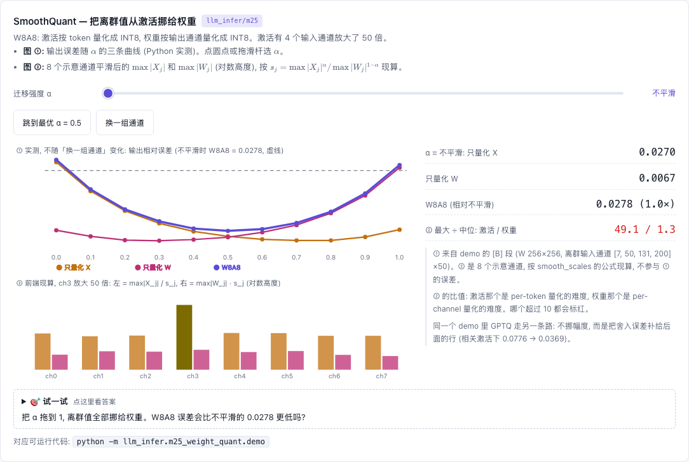

# M25 — GPTQ / SmoothQuant / FP8: 量化的另外三条路

[](https://beleev.github.io#/infer/quant-awq)

[打开相关交互实验：SmoothQuant — 把离群值从激活挪给权重 llm_infer/m25](https://beleev.github.io#/infer/quant-awq)

## 直觉

m08 讲过: 同样的 bit 数, 差别在"组"怎么划; AWQ 再用缩放保护激活大的输入通道。
这里接着讲另外三种病和各自的治法:

| 方法 | 治什么病 | 手段 | 量化谁 |
|---|---|---|---|
| AWQ (m08) | 少数**重要**输入通道的权重误差被激活放大 | 放大这些行再量化, `XW=(X/s)(s⊙W)` | 只量化权重 |
| **GPTQ** | RTN 的舍入误差各自为政, 在输出上累加 | 量化一行, 把误差按 H⁻¹ **补**到后面没量化的行 | 只量化权重 |
| **SmoothQuant** | 激活的**离群通道**让激活没法 INT8 | 同一个缩放恒等式, 把离群值从激活**挪**给权重 | 权重 + 激活 (W8A8) |
| **FP8** | INT8 的等间距格点对大动态范围不友好 | 换成浮点格点: 相对误差恒定 | 权重 + 激活 |

- **weight-only (AWQ / GPTQ)**: 省显存和 decode 带宽。
- **W8A8 (权重和激活都是 8 bit) / FP8**: matmul 本身走低精度 tensor core, prefill 也快。

RTN (round-to-nearest) 是 m08 的基线: 不做任何补偿, 直接把每个数舍入到最近的格点。

## 核心原理

### 核心数据结构或公式

**GPTQ** (`gptq.py:gptq_quantize`): 输出误差是二次型 `‖XΔW‖² = N·tr(ΔWᵀ H ΔW)`, `H = XᵀX/N`。
```
H += 0.01·mean(diag H)·I;   U = chol(H⁻¹)ᵀ  (上三角, H⁻¹ = UᵀU)
for i in 0..D_in-1:                         # 逐个输入通道 (W 的行; 论文里是列)
    if i % g == 0: 用"已补偿过"的 W[i:i+g] 现算这一组的 scale/lo
    Q[i] = RTN(W[i]);   δ = (W[i] − Q[i]) / U[i,i]
    W[i+1:] -= U[i, i+1:]ᵀ ⊗ δ               # 误差摊给后面的行
```
H 对角 (输入通道互不相关) 时 U 的非对角元为 0, GPTQ 就是 RTN。收益**全部**来自激活通道间的相关性。
存储格式与 m08 的 group-wise INT4 完全相同, 推理 kernel 不变。

**SmoothQuant** (`smoothquant.py:smooth_scales`, `w8a8_matmul`):
```
s_j = max|X_j|^α / max|W_j|^(1−α)          X' = X / s,  W' = s ⊙ W   (X'W' = XW)
W8A8: X' per-token 对称 INT8 (动态), W' per-output-channel 对称 INT8 → 两个 scale 都能提到 matmul 外面
```
**FP8** (`fp8.py:fp8_round`, `fake_quant_fp8`): 每个数的格距 = `2^(⌊log2|x|⌋ − m)`, 指数下限钉在最小正规数。
| 格式 | 指数/尾数 | max | 最小正规数 | 正规区相对误差上界 |
|---|---|---|---|---|
| E4M3 (fn) | 4 / 3 | 448 | 2^-6 | 2^-4 = 6.25% |
| E5M2 | 5 / 2 | 57344 | 2^-14 | 2^-3 = 12.5% |

## 运行

在仓库根目录执行：

```bash
python -m llm_infer.m25_weight_quant.demo
```

## 运行后应该看到什么

```bash
python -m llm_infer.m25_weight_quant.demo     # < 1 s
```
```
[A] GPTQ vs RTN: INT4 group=32 非对称
  A1 激活通道相关        calib 误差   held-out 误差
     RTN                   0.0778        0.0776
     GPTQ                  0.0316        0.0369          ← 降 52%
  A2 激活 iid:  N=256 GPTQ 0.1226 vs RTN 0.0786 (1.56x)  …  N=8192 0.0791 (1.01x)
  A3 相关 + 离群通道 ×30:  RTN 0.0749  AWQ(α=0.4) 0.0258  GPTQ 0.0293  AWQ+GPTQ 0.0113
[B] SmoothQuant W8A8, 离群通道 ×50     只量化 X  只量化 W   W8A8
  不平滑                                0.0270    0.0067   0.0278
  α=0                                   0.0307    0.0072   0.0315
  α=0.5                                 0.0051    0.0048   0.0070   ← 最优, 降 4.0x
  α=1                                   0.0074    0.0288   0.0297   ← 离群值全压到权重上
[C] e4m3 正规区最大相对误差 0.0588 (≤ 0.0625); e5m2 0.1111 (≤ 0.125); 超 max 饱和
  C1 std=0.002 权重直接转 e4m3 0.2801 / 加 scale 0.0265     (e5m2 直接转 0.0529, 不受影响)
  C2 列幅度悬殊          per-tensor  per-channel   改善
     FP8 e4m3              0.0257      0.0251    1.02x
     INT8                  0.0543      0.0070    7.71x
  C3 W8A8 激活 per-tensor, 离群 ×50:  FP8 e4m3 0.0360   FP8 e5m2 0.0730   INT8 0.0606
```
断言:
- A1: GPTQ < 0.6×RTN。
- A2: 小校准集 GPTQ > 1.2×RTN; N 增大单调逼近, 且 N=8192 在 5% 内。
- A3: AWQ+GPTQ < 0.6×min(AWQ, GPTQ)。
- B: 不平滑时激活误差 > 3×权重误差; 最优 0<α<1 且 < 0.4×不平滑; α=1 权重误差 > 3×最优。
- C: 舍入误差不超上界; INT8 per-channel 改善 > 5x 而 FP8 < 1.2x; E4M3 在激活离群时 < 0.7×INT8。

## 与真实系统的差距

- **GPTQ 的收益取决于激活相关性**。iid 激活下它最多与 RTN 打平。
  校准样本少 (N=256 对 D_in=256) 时, 它会把采样噪声当相关性去补偿, held-out 误差反而比 RTN 高 56%。
- 这里用"低秩公共成分 + 噪声"合成相关激活来显出效果。真实 LLM 激活确实强相关, 但幅度不是这个数。
- 真 GPTQ 还有 act-order (按 diag H 从大到小量化)、lazy batch (128 行一批)、逐层用上一层**量化后**的输出做校准。这里单层, 不做 act-order。
- 真实部署常把 AWQ 和 GPTQ 视为二选一。A3 的"先缩放再 GPTQ"是教学组合, 说明二者治的是不同的病。
- SmoothQuant 的 α 在真实模型上按层搜索 (常见 0.5~0.85)。这里只有一层, 最优 α 恰好 0.5 是数据决定的。
- numpy 里全是 fake quant (量化再反量化后用 fp32 算), 没有 INT8 / FP8 GEMM, 不能说明速度。
- FP8 per-channel 在这里几乎没收益, 因为合成权重没有落出正规区的小值。
  真实系统 (DeepSeek-V3) 用 block-wise scale, 主要是防激活/权重的局部离群值挤占 448 的上限, 不是为了格点精度。
- C2 里 INT8 per-channel (0.0070) 比 E4M3 per-channel (0.0251) 还准: 没有离群值的分布, 均匀格点更划算。FP8 不是处处胜过 INT8。

## 常见误区

- "GPTQ 就是更好的 RTN, 总能降误差" —— 只在激活通道相关时成立。校准集太小还会过拟合 (A2)。
- "SmoothQuant 的 α 越大越好, 激活越平越好" —— 激活平了, 离群值跑到权重上, α=1 的 W8A8 误差 (0.0297) 比不平滑还差。
- "SmoothQuant 和 AWQ 是一回事" —— 恒等式相同。AWQ 为了保护权重 (weight-only), SmoothQuant 为了让激活能量化 (W8A8)。
- "FP8 必须 per-channel scale" —— FP8 的格点随数值伸缩, per-tensor 已经够用 (vLLM FP8 激活默认 per-tensor)。INT8 才离不开细粒度 scale。
- "FP8 不用 scale 直接转就行" —— 权重幅度小时 E4M3 掉进非正规区, 误差 0.28 vs 加 scale 0.027 (C1)。

## 自测题

1. 若校准激活的 H 恰好是对角矩阵, GPTQ 的结果和 RTN 有什么关系?
   **答**: 完全相同。H⁻¹ 也对角, 其 Cholesky 因子 U 的非对角元为 0, `W[i+1:] -= U[i,i+1:]ᵀ⊗δ` 什么也不做。
2. SmoothQuant 中 α=0 时, s_j = 1/max|W_j|, 为什么 W8A8 误差 (0.0315) 比不平滑 (0.0278) 还略大?
   **答**: α=0 把每行权重归一到 max=1, 同时激活乘上 max|W_j|。激活的离群通道一点没压, 还给权重多引入了按行的幅度变化。
3. 为什么 H100 推理用 E4M3 而不是 E5M2?
   **答**: 推理的权重/激活经 scale 后动态范围有限, 多 1 bit 尾数 (相对误差 6.25% vs 12.5%) 更值。E5M2 的大范围留给梯度。
