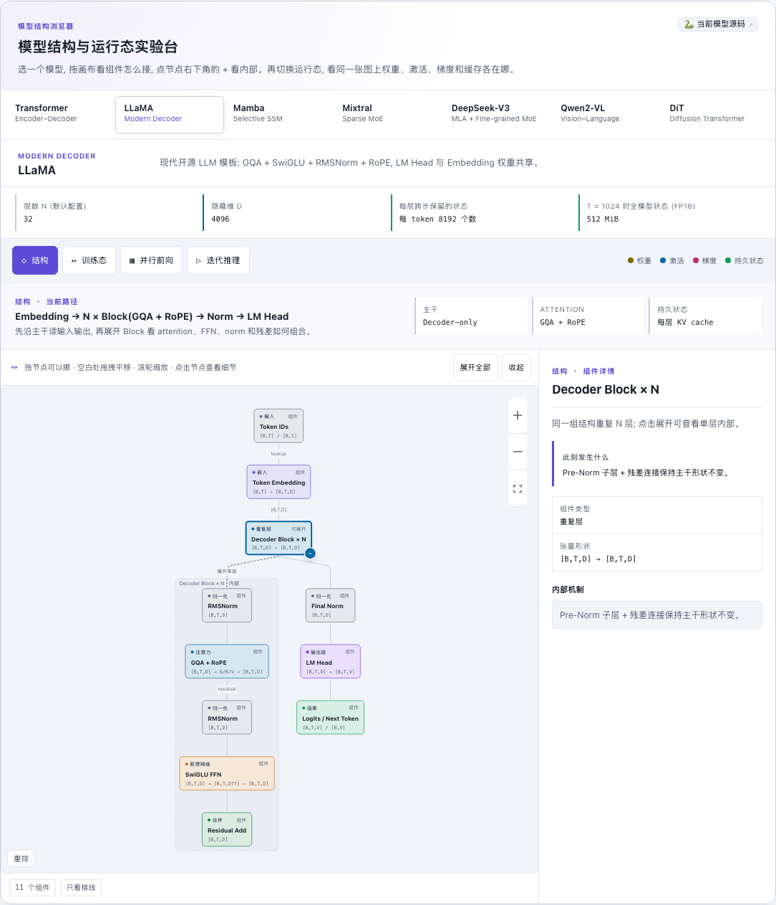

# llm_models — 23 个模型的 PyTorch 实现

[](https://beleev.github.io/llm-engineering-lab/#/models)

[打开相关交互实验：LLaMA 模型结构与运行态](https://beleev.github.io/llm-engineering-lab/#/models)

[项目首页](../README.md) · [在线教程](https://beleev.github.io/llm-engineering-lab/#/models)

## 概览

> 从 2017 年的 Transformer 到 2025 年的 GPT-OSS / LLaDA / Qwen3-Next, 每个模型一个文件。
> 全部在 CPU 上跑, 配置缩到几层、几百维, 数据是合成的。目的是看清结构和数据流, 训不出能用的模型。

### 设计约定

- **零件和组装分开**: 注意力、FFN、归一化、位置编码都在 `layers/`。模型文件只做组装, 两个模型的差别落在构造参数上。
- **一个训练循环**: `training/Trainer` 只认 "数据生成器" 和 "loss" 两个接口, 换模型不改循环。
- **一份生成代码**: decoder-only LM 都继承 `utils/generation.py::GenerationMixin`, 共用带 KV cache 的 `generate()`。
- **脚本以 `assert` 结尾**: `infer_*` 验证结构性质 (因果性、有无 cache 输出相同); `train_*` 验证初始 loss 落在理论值附近 (LM 是 ln V) 且能下降。
- **每个模型目录有 README**: 直觉 / 核心原理 / 运行 / 运行后应该看到什么 / 与真实系统的差距 / 常见误区 / 3 道自测题。

## 运行

都在仓库根目录执行。

```bash
python main.py                                                   # 冒烟: 10 个最小前向, LM 另断言初始 CE ≈ ln V、有无 cache 输出相同
python -m llm_models.run_models.language_models.llama.infer_llama    # 单个脚本: <类别>.<目录>.infer_<目录>
python -m llm_models.run_models.moe.deepseek.train_deepseek          # 训练脚本: <类别>.<目录>.train_<目录>
pytest -k llm_models                                             # 全部 infer 脚本
pytest -m slow -k llm_models                                     # 全部 train 脚本
```

共 48 个脚本: 25 个 `infer_*`, 23 个 `train_*`。`rope_scaling` 和 `vae3d` 只有 infer。

## 模块与阅读顺序

### 分层

```
layers/      零件: core (注意力 / FFN / 归一化 / 位置编码 / Block) · sparse (MoE / SSM / DeltaNet) · multimodal · diffusion
models/      23 个模型类, 按 foundation / language_models / moe / multimodal / generative 分目录
training/    Trainer · TrainingConfig · 合成数据生成器 · 各种 loss · 扩散调度器与采样器
utils/       generation (KV cache + generate) · init (N(0, 0.02²)) · masks
run_models/  <类别>/<模型>/{infer_*.py, train_*.py, README.md}
```

依赖是单向的: `layers → models → training → run_models`, 下层不 import 上层。两个例外:

- `models/language_models/llada.py` 在文件头 import 了 `training.loss.LossComputer`。
- `models/language_models/mtp.py` 在 `__getattr__` 里惰性 import `training.loss.MTPLoss`。

### 模型清单

文件路径相对 `models/`。讲义在 `run_models/<类别>/<目录>/README.md`。

**语言模型 (9)**

| 模型 | 文件 | 核心类 | 相对基线的关键差异 | 讲义 |
|---|---|---|---|---|
| Transformer | `foundation/transformer.py` | `Transformer` | 基线: Encoder-Decoder, MHA + ReLU-FFN + LayerNorm + Sin-PE | [readme](run_models/language_models/transformer/README.md) |
| BERT | `language_models/bert.py` | `BERT` | 只留 Encoder, 去掉因果 mask, 目标换成 MLM | [readme](run_models/language_models/bert/README.md) |
| GPT-3 | `language_models/gpt3.py` | `GPT3` | 只留 Decoder, 因果 mask + GELU-FFN, 预测下一个 token | [readme](run_models/language_models/gpt3/README.md) |
| LLaMA | `language_models/llama.py` | `LLaMA` | GPT-3 换四个零件: GQA、SwiGLU、RMSNorm、RoPE | [readme](run_models/language_models/llama/README.md) |
| Mistral | `language_models/mistral.py` | `Mistral` | LLaMA 的因果 mask 裁成带状, cache 滚动裁到 W | [readme](run_models/language_models/mistral/README.md) |
| MTP | `language_models/mtp.py` | `MTPLLaMA` | LLaMA 后接 K 级 MTP 模块, 多预测更远的 token | [readme](run_models/language_models/mtp/README.md) |
| Qwen3-Next | `language_models/qwen3_next.py` | `Qwen3Next` | 75% 的层换成 Gated DeltaNet, 25% 保留 GQA | [readme](run_models/language_models/qwen3_next/README.md) |
| Mamba | `language_models/mamba.py` | `Mamba` | 不用注意力: 因果卷积 + Selective SSM, 状态定长 | [readme](run_models/language_models/mamba/README.md) |
| LLaDA | `language_models/llada.py` | `LLaDA` | 去掉因果 mask 的 LLaMA, 掩码扩散训练, 多步去噪生成 | [readme](run_models/language_models/llada/README.md) |

**MoE (4)**

| 模型 | 文件 | 核心类 | 相对基线的关键差异 | 讲义 |
|---|---|---|---|---|
| Mixtral | `moe/mixtral.py` | `Mixtral` | LLaMA 的 FFN 换成 E 个专家选 K 个, softmax 路由 + aux loss | [readme](run_models/moe/mixtral/README.md) |
| DeepSeek-V3 | `moe/deepseekV3.py` | `DeepSeekV3` | GQA 换 MLA; sigmoid 路由 + 共享专家; 用 bias 做负载均衡 | [readme](run_models/moe/deepseek/README.md) |
| DeepSeek-V3.2 | `moe/deepseekV3.py` | `DeepSeekV3_2` | V3 加 Lightning Indexer, MLA 只在 top-k 个 key 上算 | [readme](run_models/moe/deepseek_v3_2/README.md) |
| GPT-OSS | `moe/gpt_oss.py` | `GPTOSSMini` | Mixtral 骨架: 偶数层 SWA、奇数层全注意力, 每 head 一个 sink | [readme](run_models/moe/gpt_oss/README.md) |

**多模态 (4)**

| 模型 | 文件 | 核心类 | 相对基线的关键差异 | 讲义 |
|---|---|---|---|---|
| CLIP | `multimodal/clip.py` | `CLIPModel` | 图文双塔, 对比 loss, 可学习温度 | [readme](run_models/multimodal/clip/README.md) |
| Whisper | `multimodal/whisper.py` | `Whisper` | Transformer 的 encoder 输入换成 mel 声谱图 | [readme](run_models/multimodal/whisper/README.md) |
| Qwen2-VL | `multimodal/qwen2_vl.py` | `Qwen2VLModel` | 视觉 token 当前缀拼进 LLaMA 式 decoder; M-RoPE | [readme](run_models/multimodal/qwen2_vl/README.md) |
| Qwen2.5-Omni | `multimodal/qwen2_5_omni.py` | `Qwen2_5_OmniModel` | 再加视频、音频前缀, 加一个 Talker 输出语音 codec token | [readme](run_models/multimodal/qwen2_5_omni/README.md) |

**生成模型 (6)**

| 模型 | 文件 | 核心类 | 相对基线的关键差异 | 讲义 |
|---|---|---|---|---|
| VAE | `generative/vae.py` | `ImageVAE` | 把图像压成高斯 latent, 给扩散模型当输入 | [readme](run_models/generative/vae/README.md) |
| Causal 3D VAE | `generative/vae3d.py` | `CausalVideoVAE` | VAE 搬到视频: 因果 3D 卷积, 时间和空间一起压 | [readme](run_models/generative/vae3d/README.md) |
| DiT | `generative/dit.py` | `DiT` | latent 切 patch 当 token, 条件经 adaLN-Zero 注入 | [readme](run_models/generative/dit/README.md) |
| MM-DiT | `generative/mmdit.py` | `MMDiT` | 文本和图像两条流做联合注意力, 目标换成 Flow Matching | [readme](run_models/generative/mmdit/README.md) |
| Video DiT | `generative/video_dit.py` | `VideoDiT` | DiT 的 patch 换成时空 tubelet, 位置嵌入分时间和空间 | [readme](run_models/generative/video_dit/README.md) |
| VAR | `generative/var.py` | `VARModel` | 自回归的一步是一整级 token map, 级内并行 | [readme](run_models/generative/var/README.md) |

另有两份只讲零件的讲义: [attention](run_models/foundation/attention/README.md) 和 [RoPE 长度外推](run_models/foundation/rope_scaling/README.md)。

## 实现说明

### forward 返回类型

三种都有, `GenerationMixin` 用 `_logits_of()` 统一取 logits。自己调 `forward` 时按下表拆。

| 返回 | 模型 |
|---|---|
| `Tensor` | Transformer / BERT / GPT3 / LLaMA / Mistral / Qwen3Next / Mamba / LLaDA / Whisper / Qwen2VLModel / DiT / MMDiT / VideoDiT |
| `(logits, 每层一份 routing_info)` | Mixtral / DeepSeekV3 / DeepSeekV3_2 / GPTOSSMini |
| `dict` | MTPLLaMA `{logits, mtp_logits}` · CLIPModel `{image_features, text_features, logit_scale}` · ImageVAE 和 CausalVideoVAE `{recon, z, mean, logvar}` · VARModel `{logits, labels}` · Qwen2_5_OmniModel `{text_logits, audio_logits, thinker_hidden_states}` |

同名参数 `return_hidden=True` 有两种含义:

- `LLaMA`: 返回 hidden, 不返回 logits。
- `BERT` 和 `Qwen2VLDecoder`: 返回 `(logits, hidden)`。

`Qwen2_5_OmniModel` 传 `return_dict=False` 时返回三元 tuple。

### 本库统一的教学约定

下面几条是本库为了教学统一加的, 不是原模型的特征。各模型 readme 的「与真实系统的差距」会逐个说明。

- **weight tying**: LM 的 `lm_head` 与 token embedding 共享权重。例外: `Transformer` 和 Omni 的 Talker 不共享。
- **embedding 乘 √D**: `Transformer`、`LLaDA` 和除 `Mamba` 外的 decoder-only LM 都乘。`BERT`、`Whisper`、`CLIP` 不乘。
- **N(0, 0.02²) 初始化**: `utils/init.py::init_weights` 作用于所有 Linear 和 Embedding, 让初始 CE ≈ ln V。DiT / MM-DiT / Video DiT 不调用它, 它们靠 adaLN 的零初始化起步。
- **固定一个 batch 反复训**: `SyntheticDataGenerator.fixed` 默认 True。loss 下降只说明模型背下了这个 batch, 检查的是梯度通路。
  `attention` 和 `llada` 的 train 脚本每步采新数据, 是例外。
- **Pre-LN**: Transformer block 都是 `x + f(norm(x))`, 包括原论文是 Post-LN 的 Transformer 和 BERT。

### llm_finetune 依赖的内部细节

`llm_finetune` 的基座模型是 `LLaMA`。改下面这些名字或行为, 微调那一章会坏。

- **forward 签名**: `LLaMA.forward(idx, attention_mask=None, cache=None, return_hidden=False)`。
  奖励模型、PRM、PPO 的 critic 都靠 `return_hidden=True` 取 `ln_f` 之后的隐状态。
- **属性名**: `d_model` (接 value head 时要用)、`layers` (按下标取层、数层数)、`lm_head`。
- **线性层的名字和类型**: LoRA / DoRA / QLoRA 按属性名找层, 只替换 `nn.Linear`。
  - 注意力: `layers[i].attn.w_q / w_k / w_v / w_o`。
  - SwiGLU: `layers[i].ffn.w_gate / w_up / w_down`。
- **Trainer 只优化 `requires_grad=True` 的参数**: 要冻结的部分 (LoRA 的基座、蒸馏的 teacher、DPO 的 ref) 必须在构造 `Trainer` 之前冻结。
- **第 1 步 lr = 0**: warmup 从 0 起, 第 1 步的 `optimizer.step()` 不改参数。日志里第一条 loss 是未训练模型的 loss。
- **基类**: `training.loss.LossComputer` 和 `training.data.SyntheticDataGenerator` 被微调的 loss 和数据生成器继承。

## 边界

### 已知边界

- **`generate(attention_mask=...)`**: 带 `generate()` 的模型 forward 都收这个参数。左 pad 批量生成与逐条生成是否一致, 分三种:
  - 一致: LLaMA / Mistral / MTPLLaMA / Mixtral / GPTOSSMini / DeepSeekV3 / DeepSeekV3_2, 以及 `use_rope=True` 的 GPT3。
    RoPE 只看相对位置, 整体平移不改变真实 token 的输出。MLA 的位置只在 RoPE 段; V3.2 的 indexer 先 mask 再选 top-k。
  - 一致, 另要处理递推状态: `Qwen3Next`。DeltaNet 层在 pad 位置取 β=0、α=1, 状态原样传过去。
    不这样做 pad 会写进状态: infer 脚本的配置下, 左 pad 5 位后真实位置 logits 差 8.1e-03。
  - 一致, 另要处理卷积窗口和状态: `Mamba`。pad 位置的卷积输入和 SSM 输入置 0, 与 HF 相同。不这样做, 左 pad 3 位后真实位置 logits 差 0.175。
  - 做不到, mask 里有 0 就抛 `NotImplementedError`: 默认 Sin-PE 的 GPT3 (绝对位置, pad 会挪动真 token)。批量生成请用等长 prompt。
- **序列超过 `max_len` 就报错**: 带位置编码的 decoder LM 在 forward 开头检查 `past + T`, 抛出的 `ValueError` 写明上限。Mamba 没有位置编码, 也没有上限。
- **训练步数不能超过 `config.num_steps`**: 学习率调度按它建, 走过之后余弦掉头、lr 回升。`Trainer.train(num_steps)` 超出时开训前就抛 `ValueError`。
- **上下文写满之后没有 cache**: 序列到 `max_len` 后窗口每步左移, 所有位置都变, `generate()` 每步整段重算。
- **没有 `generate()` 的模型**: Transformer 和 Whisper 在脚本里手写贪心循环; Qwen2-VL 和 Omni 只能整段前向; LLaDA 用自己的 `sample()`。
- **没有真实数据**: 没有 tokenizer, 没有数据集, 没有 checkpoint 读写。要看训练工程见 `llm_train`, 要看可学习的任务见 `llm_finetune`。
