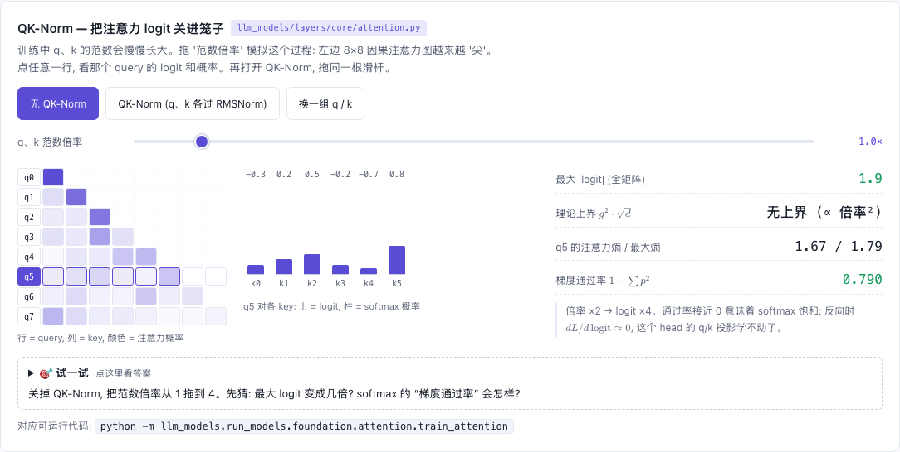

# Attention (Scaled Dot-Product / Multi-Head)

[](https://beleev.github.io#/models/qknorm-yarn)

[打开相关交互实验：QK-Norm — 把注意力 logit 关进笼子 llm_models/layers/core/attention.py](https://beleev.github.io#/models/qknorm-yarn)

## 直觉

一次"软查表": 每个 token 发出一个查询 q, 和所有 token 的 k 比相似度, 按相似度加权取回它们的 v。查哪里由内容决定, 不由位置决定。

## 核心原理

### 核心公式

```
Attention(Q, K, V) = softmax(Q Kᵀ / √d_k + mask) V        # mask: 不可见位置填 -inf
MultiHead = Concat(head_1..head_H) W_O,  head_i 在 d_model/H 维子空间里各做一次上式
```
除以 √d_k: q·k 是 d_k 个独立乘积之和, 方差 ≈ d_k; 不缩放 softmax 会饱和成 one-hot, 梯度消失。

## 运行

```bash
python -m llm_models.run_models.foundation.attention.infer_attention
python -m llm_models.run_models.foundation.attention.train_attention
```

## 运行后应该看到什么

### (CPU 实测)

- infer: `var(q·k) = 70.2 (d_k=64), 缩放后 1.10; softmax 最大权重: 不缩放 0.83 vs 缩放 0.25`;
  权重行和为 1, 因果 mask 下 `w[0,0,:3] = [1.0, 0.0, 0.0]`; 改未来 token 过去输出变化 0; 置换等变误差 8.9e-08。
- train (联想检索, 每步新数据): 无 attention 基线 mse 0.998 (= 瞎猜); 单层 MHA 1.003 → 0.013 (400 步, 约 5 秒)。

## 与真实系统的差距

- **规模**: train 是单层 4 头注意力, d_model=64, 序列 9 个位置 (8 个键值对 + 1 个查询)。没有残差、FFN 和归一化。
- **数据是合成的**: key / value 是 `randn` 向量, 直接当输入, 没有 token 和 embedding。每步新采样, 所以这里的 loss 下降是学会了检索。
- **`MultiHeadAttention` 是教学版**: 每个 head 是一个独立的 `SingleHeadSelfAttention`, 用 Python 循环逐头算, 不支持 KV cache。本库要 cache 的模型都用 `GroupedQueryAttention`。
- **分数矩阵整张算出来**: 先得到 `[T, S]` 的分数, 再填 -inf、softmax。FlashAttention 这类 kernel 分块算, 不把整张矩阵写进显存 (见 `llm_infer/m11_flash_attention`)。

## 常见误区

- "attention 天然知道词序" —— 不知道。无位置编码时它是置换等变的 (infer 第 4 条断言), 词序全靠 PE / RoPE 注入。
- "mask 是把权重乘 0" —— 是在 softmax **之前**把分数置 -inf; 之后再乘 0 会让每行和不为 1。
- "多头 = 参数变多" —— 每头维度是 d_model/H, 总参数量与单头相同; 多头买到的是多种不同的注意力模式。

## 自测题

1. d_k 从 64 变成 256, 不缩放时 q·k 的标准差变为几倍? —— 2 倍 (std = √d_k: 8 → 16)。
2. 为什么逐 token 的 Linear 在检索任务上 mse 停在 1? —— 查询位置看不到其它 token, 最优输出只能是 value 的均值 0, 误差 = value 方差 = 1。
3. self-attention 计算量对序列长度 T 的复杂度? —— O(T²·d): 分数矩阵是 T×T。
