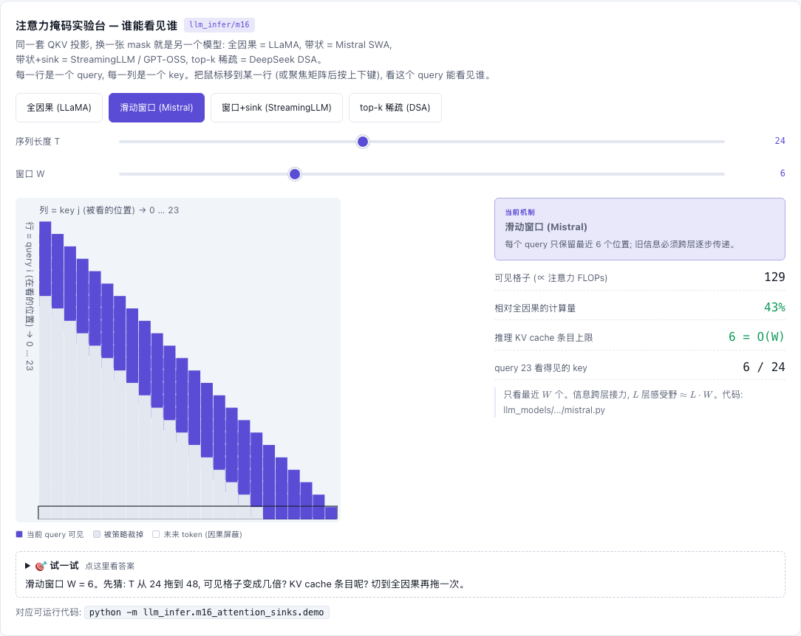

# Mistral — LLaMA + 滑动窗口注意力 (SWA)

[](https://beleev.github.io#/models/swa-mtp)

[打开相关交互实验：注意力掩码实验台 — 谁能看见谁 llm_infer/m16](https://beleev.github.io#/models/swa-mtp)

## 直觉

每个位置只看最近 W 个 token。看起来丢了长程信息, 其实信息会跨层接力: 第 2 层看到的 "邻居" 已经各自汇总过它们的邻居,
L 层后感受野 ≈ L·W。SWA 不需要新的注意力类 —— 只是把下三角 mask 裁成带状。

## 核心原理

### 核心公式

- 可见性: `j ≤ i 且 j > i − W`。可见格子数 `W(W+1)/2 + (T−W)·W ≈ T·W` (全因果是 `T(T+1)/2`)。
- KV cache: rolling buffer, 每层只留最近 W 个 K/V → 显存 O(W) 而不是 O(T)。
- 带 cache 的 mask: 行 `[past:past+T]`, 列只取最后 `min(past, W) + T` 列 (与被裁剪的 cache 对齐)。

## 运行

```bash
python -m llm_models.run_models.language_models.mistral.train_mistral
python -m llm_models.run_models.language_models.mistral.infer_mistral
```

## 运行后应该看到什么

### (实测, CPU)

- train: `初始 loss 7.076 vs ln V = 6.908 | 最终 loss 0.058`。
- infer:
  - `[1]` 参数量 LLaMA = Mistral = 3,076,352。
  - `[2]` T=64 可见格子: 全因果 2080 vs 带状 484 (W=8)。
  - `[3]` 单层模型: 改位置 0 只影响位置 0..7 的输出; 4 层感受野 ≈ 32。
  - `[4]` 读了 21 个 token, 每层 cache 只有 8 个; 生成 200 token 有/无 cache 一致, 加速约 7x。

## 与真实系统的差距

- **规模**: demo 的 W=8, train 是 2 层、d_model=256。Mistral-7B 是 32 层、W=4096、32 个 Q head / 8 个 KV head。
- **本库约定**: `lm_head` 与 embedding 共享权重, embedding 乘 √D。这是本库 LM 统一的写法, 不代表原模型的做法。
- **rolling buffer 的实现**: 本库每步先把新 K/V `cat` 到 cache 后面, 再切出最后 W 个。每步都新分配张量, 没有原地覆盖的环形缓冲。
- **整段前向没省算力**: 带状 mask 只是把窗口外的分数填成 -inf, 分数矩阵仍是 T×T。"可见格子 484" 是理论算量, 本库没有只算带内的 kernel。
- **数据是合成的**: 固定一个随机 batch (2 条 × 32 token) 反复训 60 步。固定 batch 是本库约定。

## 常见误区

- "窗口 W 之外的 token 完全看不到": 单层是; 多层会接力, 所以脚本第 3 项特意用 1 层模型验证。
- "裁掉旧 K/V 会改变结果": 不会 —— 它们在带状 mask 下本来就是 -inf。前提是 K 存的是 RoPE 之后的 (绝对位置已烙进去), 裁剪不会让位置错位。
- "loss 下降 = 学到了东西": 固定随机 batch, 只是背诵。

## 自测题

1. Mistral-7B (32 层, W=4096) 的理论感受野? —— 32 × 4096 ≈ 131K。
2. T=131072 时 LLaMA 与 Mistral 每层各缓存多少位置? —— 131072 vs 4096。
3. 带 cache 解码时 `mask[..., -(kept+T):]` 里 kept 为什么是 `min(past, W)`? —— cache 最多留 W 个; 还没攒满 W 个时只有 past 个。
