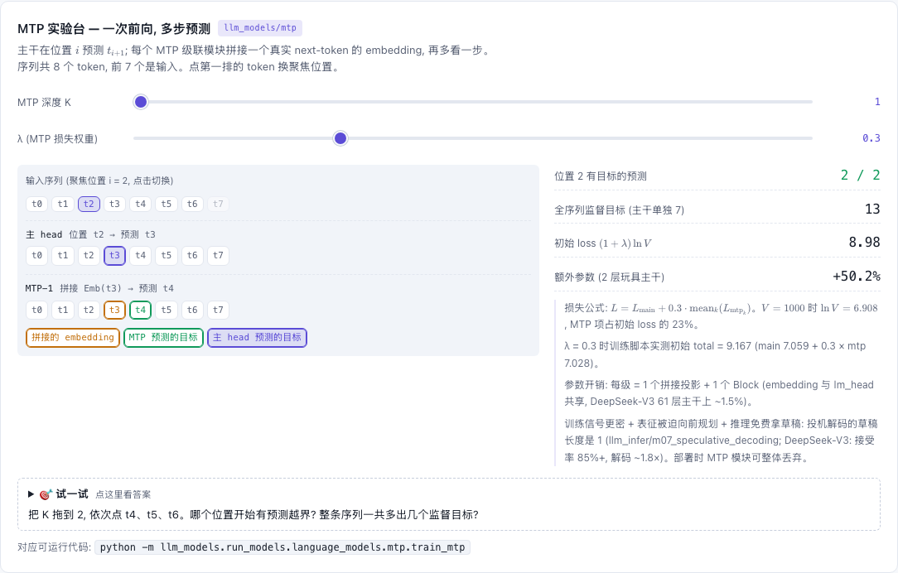

# MTP — Multi-Token Prediction (DeepSeek-V3 式)

[](https://beleev.github.io#/models/swa-mtp)

[打开相关交互实验：MTP 实验台 — 一次前向, 多步预测 llm_models/mtp](https://beleev.github.io#/models/swa-mtp)

## 直觉

普通 LM 在位置 i 只预测第 i+1 个 token。MTP 让位置 i 顺便预测第 i+2、i+3… 个:
- 训练信号更密。
- hidden 被迫 "向前规划"。
- 推理时 MTP head 的输出还能当投机解码的草稿。

DeepSeek-V3 的做法是串行级联: 第 k 级吃第 k−1 级的输出, 保持因果链。embedding 与 lm_head 和主干共享。

## 核心原理

### 核心公式

- 级联: `h^k = Block( W·[RMSNorm(h^{k-1}) ; RMSNorm(Emb(t_{i+k}))] )`, `h^0` 是主干的输出。
- `L = CE(main) + λ · mean_k CE(mtp_k)`, λ = 0.3 (后期 0.1)。
- 标签对齐: 第 k 级在位置 i 的目标是 `labels[i+k]` —— labels 左移 k 位, 末尾 k 个填 -100。
- 每级参数开销: `2D² (拼接投影) + 1 个 Block + 3D (三个 RMSNorm)`。

## 运行

```bash
python -m llm_models.run_models.language_models.mtp.train_mtp
python -m llm_models.run_models.language_models.mtp.infer_mtp
```
代码: 模型 `llm_models/models/language_models/mtp.py::MTPLLaMA`; loss `llm_models/training/loss.py::MTPLoss`。
`from llm_models.models.language_models.mtp import MTPLoss` 也可用 (惰性转发)。

## 运行后应该看到什么

### (实测, CPU)

- train: `main 7.059 → 0.047   mtp 7.028 → 0.048   (ln V = 6.908)`; 初始 total = 9.167 = main + 0.3·mtp。
- infer:
  - `[1]` LLaMA 1,666,304 → MTPLLaMA 2,503,168 (+50.2%, 因为玩具主干只有 2 层; 断言增量恰为 `2D² + Block + 3D`)。
  - `[3]` 主 logits 与同权重 LLaMA `torch.equal` → MTP 模块可零成本丢弃。
  - `[4]` 生成 200 token 有/无 cache 一致, 加速约 8.9x (生成时只跑主干, 无 cache 路径还白跑了 MTP 模块)。

## 与真实系统的差距

- **主干不同**: 本库把 MTP 接在 LLaMA 主干 (GQA + SwiGLU) 上。DeepSeek-V3 的主干是 MLA + MoE, 见 `../../moe/deepseek`。
- **规模**: 主干只有 2 层, 一级 MTP 让参数多 50.2%。DeepSeek-V3 有 61 层, 同样一级只多约 2%。
- **λ 固定**: `MTPLoss(mtp_lambda=0.3)` 全程不变。"后期 0.1" 的切换没有实现。
- **没有投机解码**: `generate()` 带 cache 时只跑主干, `mtp_logits` 为空。用 MTP head 出草稿的流程不在这个包里。
- **本库约定**: `lm_head` 与 embedding 共享权重, embedding 乘 √D。MTP 模块复用的就是这一对共享矩阵。
- **数据是合成的**: 固定一个随机 batch (2 条 × 32 token) 反复训 60 步。固定 batch 是本库约定。

## 常见误区

- "mtp loss 下降说明模型学会了预测下下个 token": 数据是固定随机 batch, 两条支路都只是背诵; 证明的是级联通路梯度可达。随机数据上第 i+2 个 token 本来没有任何可学规律。
- "MTP 会改变主干输出": 不会, 它只是主干之后的旁路 (第 3 项断言)。
- "生成时也要跑 MTP 模块": 它需要 "未来的真实 token" 的 embedding, 普通自回归时不存在; 只有投机解码才用 (本库见 llm_infer)。

## 自测题

1. mtp_depth=2, seq_len=32 时第 2 级有多少个位置参与 loss? —— 30 (末尾 2 个是 -100)。
2. 初始 total_loss 约为多少? —— `(1 + 0.3)·ln V = 8.98` (V=1000), 实测 9.167。
3. 为什么拼接前 h 和 embedding 要各自 RMSNorm? —— h 经过多层残差累加, 尺度远大于 embedding; 不归一化投影矩阵要先花容量对齐尺度。
