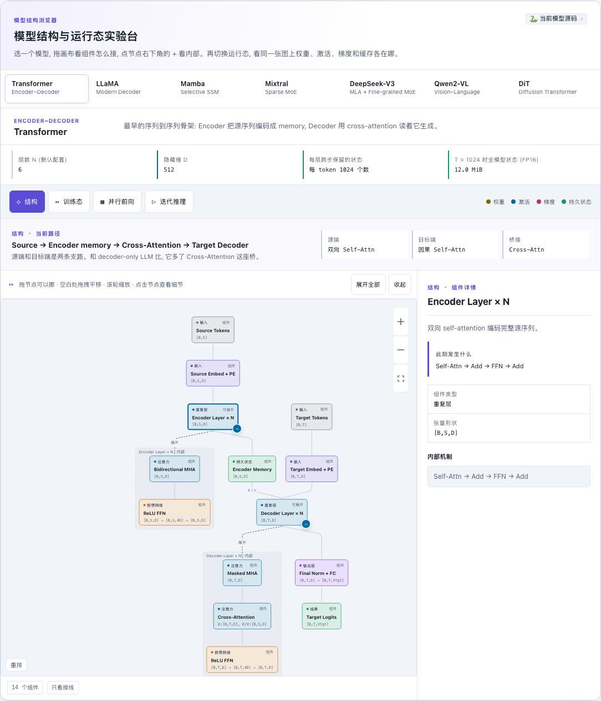

# Transformer (Encoder-Decoder, 2017)

[](https://beleev.github.io/llm-engineering-lab/#/models)

[打开相关交互实验：Transformer 模型结构与运行态](https://beleev.github.io/llm-engineering-lab/#/models)

## 直觉

翻译时先把源句**整句读完** (Encoder, 双向), 再一个词一个词写译文 (Decoder, 因果)。Decoder 每写一个词都通过 cross-attention 回头"查"一遍源句的全部位置。

## 核心原理

### 核心公式

```
Attention(Q, K, V) = softmax(Q Kᵀ / √d_k) V
self-attn : Q = K = V = 本序列          cross-attn: Q = decoder 隐状态, K = V = encoder 输出 (memory)
x = emb · √d_model + PE(pos)            PE(pos, 2i) = sin(pos / 10000^(2i/d)),  PE(pos, 2i+1) = cos(...)
```
三种 mask: `src_mask [B,1,S]` 源 padding; `tgt_mask [B,T,T]` = 因果下三角 ∧ 目标 padding; cross-attn 复用 `src_mask`。

## 运行

```bash
python -m llm_models.run_models.language_models.transformer.infer_transformer
python -m llm_models.run_models.language_models.transformer.train_transformer
```

## 运行后应该看到什么

### (CPU 实测)

- infer: `改未来 tgt → 过去 logits 变化 0.00e+00 | 改 src → 每个 tgt 位置至少变化 0.0214 | 改 src pad → 0.00e+00`, 随后打印 5 步贪心解码结果 (未训练, token 无意义)。
- train: 初始 loss 6.972 (ln 1000 = 6.908) → 60 步后 0.046 (约 6 秒)。
- src 与 tgt 是**互不相关的固定随机序列**, 下降 = 背下这个 batch。

## 与真实系统的差距

- **规模**: train 是 2 层、d_model=256、4 头、d_ff=512。类的默认参数 (6 层、d_model=512、8 头、d_ff=2048) 才是论文的 base 配置。
- **Pre-LN**: 本库所有 block 统一用 Pre-LN `x + f(LN(x))`。论文是 Post-LN。
- **没有 weight tying**: `src_embedding`、`tgt_embedding`、`fc_out` 是三个独立矩阵。本库其他 LM 都让输出层和 embedding 共享权重, 这个模型没有。
- **embedding 乘 √D**: 这一条论文里就有。N(0, 0.02²) 初始化是本库约定。
- **解码没有 KV cache**: `encode()` 只跑一次, 但 `decode()` 每步重跑整个目标前缀。只演示了贪心, 没有 beam search。
- **数据是合成的**: src 和 tgt 是互不相关的随机 token, 固定一个 batch (2 条 × 32 token) 训 60 步。固定 batch 是本库约定, 用来检查梯度通路。

## 常见误区

- "cross-attention 也要加 RoPE" —— 不要。Q 与 K 来自两条不同序列, "相对位置 i−j" 没有意义。
- "训练时 decoder 也是一步步生成的" —— 训练用 teacher forcing: 整个 tgt 一次并行喂入, 靠因果 mask 防止偷看。
- "embedding 乘 √D 只是个无关紧要的常数" —— 它决定 token 信息与位置编码的相对强度。若 embedding 是 N(0,1), 乘 √D 后幅度 ~√D, 幅度 ~1 的 PE 会被淹没。

## 自测题

1. Encoder 为什么不需要因果 mask? —— 源句在推理时是完整已知的, 双向看不构成泄漏。
2. 推理生成 T 个 token, encoder 要跑几次? —— 1 次; `memory` 不随解码步变化 (见 `encode()` / `decode()`)。
3. cross-attn 的注意力矩阵形状? —— `[B, H, T, S]`: 行是目标位置, 列是源位置, 可直接读作"软对齐"。
