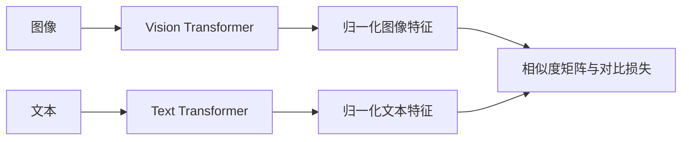

# CLIP (图文对比学习双塔)

CLIP 的双编码器：




## 直觉

一个 batch 有 B 张图和 B 句话, 拼成一张 B×B 的"相亲表": 第 i 张图应该和第 i 句话最像 (对角线), 和其余 B−1 句都不像。
不需要人工类别标签 —— batch 里的其它样本就是免费的负样本。

## 核心原理

### 核心公式

```
I = norm(ViT(image)[CLS] · W_i)      T = norm(Transformer(text)[EOS] · W_t)        # [B, E], 单位向量
logits = exp(t) · I Tᵀ               # [B, B];  exp(t) = 1/τ, 初值 1/0.07 ≈ 14.3, 上限 100
loss = ½ [ CE(logits, arange(B)) + CE(logitsᵀ, arange(B)) ]                        # 图→文 + 文→图
```

## 运行

```bash
python -m llm_models.run_models.multimodal.clip.infer_clip
python -m llm_models.run_models.multimodal.clip.train_clip
```

## 运行后应该看到什么

### (CPU 实测)

- infer: 特征范数为 1 (断言); `改 EOS 之后的 token → 句向量变化 0.0e+00; 改 EOS 之前的 → 0.0590`;
  未训练时图 0 对 4 条文本的概率 `[0.173, 0.212, 0.342, 0.273]`, 没有区分度。
- train: 初始 loss 2.180 (ln 8 = 2.079) → 30 步后 0.0004; 对角线 top-1 0.12 → 1.00; logit_scale 14.29 → 14.34 (约 3 秒)。
  若用 PyTorch 默认初始化, 初始 loss 是 2.221 —— CLIP 没有 tied lm_head, 本来就不病态。
- 8 对图文是**固定的随机数据**: 验证的是"能配上对" (记忆), 不是语义对齐。

## 与真实系统的差距

- **规模**: train 的 batch 是 8, 两个塔各 2 层、d_model=64。原版 batch 是 32768; ViT-B/32 的文本塔 12 层 d=512, 视觉塔 12 层 d=768。
- **数据是合成的**: 8 对图文是固定的随机数据, 图是 `randn`, 文本是随机 token。原版用 4 亿对真实图文。
- **负样本只有 7 个**: 每个样本的负样本是 batch 里其余 7 个。30 步 loss 就到 0.0004, 说明任务太容易, 不说明表征好。
- **文本塔没有 padding mask**: 只靠因果 mask 保证 EOS 看不到后面的 padding。行内没有 EOS 时 `argmax` 会落到位置 0。
- **没有演示零样本分类**: 自测题 3 的流程没有对应的脚本。
- **注意力是教学版**: 两个塔都用逐头循环的 `MultiHeadAttention`。

## 常见误区

- "batch 越小越省事" —— 负样本数 = B−1, batch 太小任务就太简单, 学不到细粒度区分; 原版 B = 32768。
- "温度随便设个常数" —— 特征归一化后余弦 ∈ [−1, 1], 不放大的话 softmax 几乎均匀、梯度极小; 所以 1/τ 可学习并设上限。
- "文本塔用 [CLS] 池化" —— 文本塔是因果 mask, 只有最后的 EOS 看得到全句; 视觉塔是双向的, 才用 [CLS]。

## 自测题

1. 未训练时 loss 为什么 ≈ ln B? —— 相似度矩阵每行近似常数, softmax 近似均匀, CE = −ln(1/B)。
2. 为什么要两个方向的 CE? —— 按行 softmax 是"图找文", 按列是"文找图"; 只训一个方向, 另一个方向的检索不受约束。
3. 零样本分类怎么做? —— 把 N 个类名写成 "a photo of a {class}" 编码成 N 个文本向量, 与图像向量点积后 softmax。
