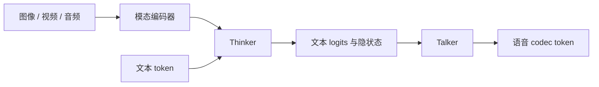

# Qwen2.5-Omni (Thinker-Talker)

Qwen2.5-Omni 的 Thinker 与 Talker：




## 直觉

两个"大脑": **Thinker** 是一个吃下图像/视频/音频/文本的 LLM, 负责想和写; **Talker** 是个小得多的自回归模型, 一边"偷看" Thinker 的隐状态, 一边吐出语音 codec token。
Talker 读的是隐状态而不是文本, 所以拿得到语气、情绪这些文本里没有的信息, 也不用等整句写完才开口。

## 核心原理

### 核心公式

```
x = concat([vision ; video ; audio ; text])  →  Thinker  →  text_logits, hidden        # 前缀路线, 同 Qwen2-VL
audio_logits = Talker(codec_tokens, context = W·hidden)                                 # 每层: 因果 self-attn → cross-attn → SwiGLU
loss = CE(text) + 0.5 · CE(audio)                                                       # 非文本位置 label = -100
```

## 运行

```bash
python -m llm_models.run_models.multimodal.qwen2_5_omni.infer_qwen2_5_omni
python -m llm_models.run_models.multimodal.qwen2_5_omni.train_qwen2_5_omni
```
两个脚本共用 `_config.py` 里的 Tiny 配置 (总参数 504,352; Thinker 122,176; Talker 27,232)。

## 运行后应该看到什么

### (CPU 实测: infer 约 2 秒, train 约 12 秒)

- infer: text_logits `[2, 4+4+4+10, 500]`, audio_logits `[2, 12, 200]`;
  `换图→语音 logits 变化 4.0e-05 | 换 codec→文本 logits 变化 0.0e+00 | 改未来 codec→过去变化 0.0e+00`
  (信息单向: 图 → Thinker → Talker; 未训练时权重 std=0.02, 所以第一项数值很小但非零)。
- train: text_loss 6.269 (ln 500 = 6.215) → 0.006; audio_loss 5.294 (ln 200 = 5.298) → 0.025。
  2 条样本的 codec 输入相同、标签不同, 不读 Thinker 时 audio_loss 下界是 ln 2 = 0.693, 实测远低于它。
  若换成默认 N(0,1) 初始化 + 绑权重: text_loss 初值是 **124.15** (50 步后 total 仍有 104.7)。
- 数据是固定随机 batch: 记忆, 不是真的会说话。

## 与真实系统的差距

- **没有 TMRoPE**: 原版把音视频按真实时间戳对齐位置编码。这里位置就是拼接后的下标 (`use_mrope=True` 会直接报错)。
- **规模**: Tiny 配置总参数 504,352。Thinker 是 2 层、d_model=64; Talker 是 1 层、d_model=32。
- **Talker 的接法**: 本库的 Talker 每层用 cross-attention 读 Thinker 的隐状态, 两条序列的长度互不影响。这是本库的写法。
- **梯度没有隔开**: `thinker_hidden` 传给 Talker 前没有 `detach`, audio_loss 的梯度会流回 Thinker。
- **只到 codec token 为止**: Talker 输出 codec token 的 logits。把 codec token 还原成波形的那一段不在库里。
- **三个编码器是同一种 ViT**: 图像、视频、音频都用随机初始化的 `PatchTransformerEncoder`。音频是把 mel 声谱图当 1 通道图像切 patch。
- **不能流式, 也不能生成**: 只有整段 teacher forcing 前向, 没有 `generate()` 和 KV cache。
- **数据是合成的**: 2 条固定的随机样本训 250 步。Thinker 的 weight tying 和 embedding 乘 √D、固定 batch 都是本库约定。

## 常见误区

- "Talker 读的是 Thinker 生成的文本" —— 读的是隐状态 `thinker_hidden`; 文本只是它的有损投影。
- "语音 token 和文本 token 共用词表 / 共用 lm_head" —— 两套词表、两个 head; Talker 的 head 也不与自己的 embedding 共享。

## 自测题

1. 为什么不让 Thinker 直接多一个语音输出头? —— 语音 token 速率远高于文本 (每秒几十个), 且两种 loss 会互相干扰; 拆出小 Talker 既低延迟又不伤文本能力。
2. 换掉 codec 输入, text_logits 为什么一位都不变? —— Thinker 的前向不依赖 Talker, 梯度只经 cross-attn 从 Talker 回流到 Thinker (训练时), 前向没有反向通路。
3. Talker 维度 (32) ≠ Thinker (64) 怎么接? —— `thinker_to_talker` 一个无 bias 线性层把 hidden 投到 Talker 维度, 再作 cross-attn 的 K/V。
