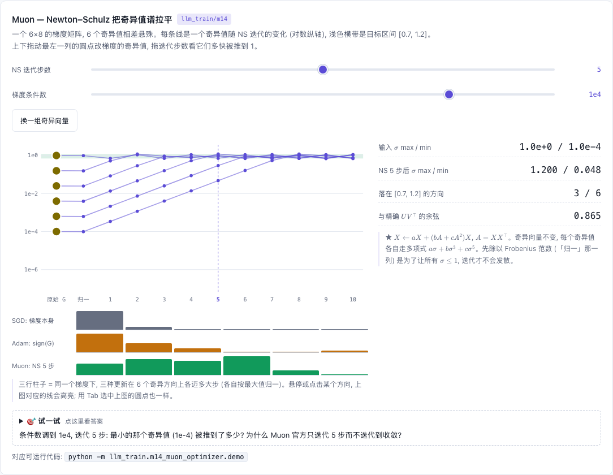

# M14 — Muon 优化器

[](https://beleev.github.io#/train/muon)

[打开相关交互实验：Muon — Newton–Schulz 把奇异值谱拉平 llm_train/m14](https://beleev.github.io#/train/muon)

## 直觉

权重矩阵的梯度 `G = UΣVᵀ` 的奇异值极不均匀, SGD/Adam 的更新被少数几个大奇异方向主导。Muon 把 Σ 全部换成 1: 更新量 `U·Vᵀ` 在每个奇异方向上步长相同。精确 SVD 太慢, 用 5 步 Newton–Schulz 多项式迭代近似 (只有矩阵乘)。

只对 2-D 隐藏层权重用 Muon; embedding、输出头、bias、norm 增益仍用 AdamW。

Muon 的更新是满秩的, 大规模训练时 attention 的 logit 容易越涨越大, softmax 变成 one-hot, 梯度消失。QK-clip 在 logit 超过阈值时把 Wq、Wk 一起缩小。

## 核心原理

### 核心公式

```
M ← μM + G;   O = NS₅(G + μM);   W ← (1 − lr·wd)·W − lr · 0.2·√max(n,m) · O
NS: X ← X/‖X‖_F;  重复 5 次  X ← aX + (bA + cA²)X,  A = XXᵀ,  (a,b,c) = (3.4445, −4.7750, 2.0315)
```
`0.2·√max(n,m)` 让更新的 RMS 与 AdamW 相当, 学习率可直接复用 (Moonlight)。

符号: `G` 梯度, `M` 动量, `μ` 动量系数, `O` 正交化后的更新方向, `wd` 权重衰减, `(n, m)` 是 W 的形状。

QK-clip:
```
S_max = 这个 batch 上最大的 attention logit;   τ = 阈值 (demo 取 100)
S_max > τ 时:  η = τ / S_max,   Wq ← √η·Wq,   Wk ← √η·Wk
```

## 运行

运行: `python -m llm_train.m14_muon_optimizer.demo`

## 运行后应该看到什么

```
输入奇异值 max / min       = 1e+00 / 1e-04
NS 1 / 3 / 5 步后 min      = 0.000 / 0.003 / 0.041      (max 始终 ≈ 1.16)
与精确 UVᵀ 的方向余弦       = 0.880
Adam: 各 lr 的末步 loss    = {0.03: 0.0731, 0.1: 0.0181, 0.3: 0.00741, 1.0: 0.00452, 3.0: 0.0134}
Muon: 各 lr 的末步 loss    = {0.03: 1.3, 0.1: 0.0355, 0.3: 0.000493, 1.0: 0.000588, 3.0: 0.00434}
旋转过的病态 (非轴对齐)     = Adam 4.52e-03 / Muon 4.93e-04  → Muon 好 9.2x
轴对齐的病态 (Adam 的主场)  = Adam 5.54e-04 / Muon 1.08e-03  → Adam 好 1.9x
max attention logit 裁剪前 → 后 = 752.1 → 100.0      (τ = 100)
```
- 两个优化器各扫 5 个 lr 取最好。两行 `各 lr 的末步 loss` 是旋转问题上的整条曲线: Adam 最优在 lr=1.0, Muon 在 0.3, 都不在网格两端。轴对齐问题只打印最优值。
- 「轴对齐」那一行是反例: 病态恰好沿坐标轴时, Adam 的逐元素缩放本来就够用。
- 对照臂是 Adam, 两边 weight decay 都为 0。这里只比 "逐元素缩放 vs 正交化"; 无噪声回归上加衰减只会把 W 往 0 拉, 多出一个不相干的变量。

## 与真实系统的差距

- 玩具问题是线性回归; "真实网络上 Muon 省 ~一半 FLOPs" 是 Moonlight/Kimi 的报告结论, 本 demo 不能证明。
- 分布式 Muon 要在 NS 前把被 ZeRO/TP 切开的矩阵 gather 成完整矩阵 —— 这是它的主要工程成本。
- NS 在 BF16 下运行; 系数是为 "快速把奇异值推进 [0.7, 1.2]" 调的, 不追求收敛到 1。
- QK-clip 这里只演示了裁剪本身; Kimi K2 的 MuonClip 是按 head 做、每步检查。

## 常见误区

- "Muon 可以用于所有参数" —— 只用于 2-D 矩阵; embedding/输出头用它反而更差。
- "NS 要迭代到收敛" —— 5 步就够, 奇异值在 0.7~1.2 内抖动不影响效果。
- "Muon 总比 Adam 好" —— 见上面轴对齐的反例。

## 自测题

1. Muon 的优化器状态比 AdamW 省多少? **答: 一半 (1 份动量 vs m+v 两份)。**
2. 为什么 NS 前要除以 Frobenius 范数? **答: 保证所有奇异值 ≤ 1, 多项式迭代才在收敛域内。**
3. QK-clip 为什么把 η 开根号分给 Wq 和 Wk? **答: logit ∝ Wq·Wk, 两边各乘 √η, 乘积正好缩 η 倍。**
