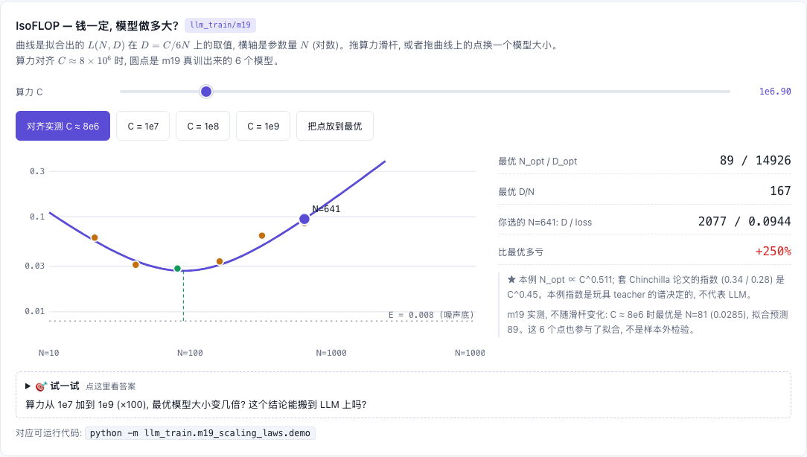

# M19 — Scaling Laws: Chinchilla 算力最优

[](https://beleev.github.io#/train/scaling)

[打开相关交互实验：IsoFLOP — 钱一定, 模型做多大? llm_train/m19](https://beleev.github.io#/train/scaling)

## 直觉

m17 / m18 把数据准备好了。开训之前还要定两个数: 模型多大 (参数量 N), 喂多少数据 (训练样本数 D)。

算力预算 C 定死了, 是训一个大模型少看点数据, 还是小模型多看点?
- 模型太小: 看再多数据, loss 也降不下去。
- 数据太少: 模型再大也学不出来。

Chinchilla 把 loss 写成三项:

```
L(N, D) = E + A / N^α + B / D^β
```
`E` 是数据本身的噪声, 谁也消不掉。后两项分别是 "模型太小" 和 "数据太少" 的代价。拟合出这 5 个数, 在 `C ≈ 6ND` 的约束下求最小值, 就得到最优的 N 和 D。

两篇论文的结论不同:
- **Kaplan (2020)**: "优先堆参数" (N_opt ∝ C^0.73)。
- **Chinchilla (2022)**: 指出 Kaplan 对所有规模用了同一个 cosine 周期长度。小数据的模型没退火完就被评估, 数据的作用被低估了。重新拟合后 N、D 大约各占一半 (∝ C^0.5), 约 20 token / 参数。

## 核心原理

### 核心数据结构与控制流

- `demo.py:sample` — teacher: 512 个 tanh 单元, 输出权重按 1/k 衰减, 加方差 0.01 的标签噪声。窄学生只学得到头部, 宽度的作用因此是幂律。
- `demo.py:train` — 学生是单隐层 tanh MLP。每步取新样本, 共见 D 个, 即单遍数据。cosine 退火的周期 = 本次的 D (Chinchilla 的修正)。
- `demo.py:fit_scaling_law` — 变量投影: α、β 走网格, 每格用线性最小二乘解 E、A、B ≥ 0, 残差按相对误差计。
- `demo.py:compute_optimal` — 闭式解, main 里再用数值搜索核对。

### 核心公式

```
C = 6ND   (前向 2ND + 反向 4ND)
N_opt = G·(C/6)^a,  D_opt = (C/6)^b / G
a = β/(α+β),  b = α/(α+β),  G = (αA / βB)^(1/(α+β))
```

## 运行

运行: `python -m llm_train.m19_scaling_laws.demo` (约 3.5 秒, 真训 36 个模型)

## 运行后应该看到什么

```
   N \ D     2048     4096     8192    16384    32768    65536
      21   0.1278   0.1039   0.0629   0.0608   0.0603   0.0603
      81   0.1016   0.0652   0.0367   0.0285   0.0248   0.0195
     641   0.0853   0.0453   0.0253   0.0164   0.0132   0.0123
E / A / α / B / β = 0.0080 / 1.213 / 1.075 / 460.3 / 1.125     相对残差 RMS 0.100
a = 0.511, b = 0.489
C = 1e+07: N_opt = 100,  D_opt = 16657,  D/N = 166
C = 1e+09: N_opt = 1054, D_opt = 158078, D/N = 150
IsoFLOP (C ≈ 7.99e+06): N=21:0.0603, N=41:0.0312, N=81:0.0285, N=161:0.0338, N=321:0.0632, N=641:0.0853
实测最优 N / 拟合预测 N_opt = 81 / 89
```
- N=21 那一行: 数据从 16K 加到 65K, loss 纹丝不动 (0.0608 → 0.0603), 被模型大小卡住了。
- 拟合出的 E = 0.0080, 真实的标签噪声方差是 0.01。E 确实就是 "不可约" 的那部分。
- IsoFLOP 曲线是 U 形: 太小的模型和太大的模型都不如中间的 N=81。

## 与真实系统的差距

- **指数和论文完全不同**: 这里 α ≈ 1.08、β ≈ 1.13, 论文是 0.34 / 0.28。玩具 teacher 的谱 (1/k) 决定了 α, 不能拿来推断 LLM。
- a ≈ 0.51 和 Chinchilla 的 0.5 接近, 这是**巧合**。a 只取决于 α、β 的比值, 本例两者碰巧差不多。换个 teacher 谱, a 就会变。
- D/N ≈ 150, 不是 20。这里一个 "token" 是一个回归样本, 和语言 token 的信息量不可比。
- 所有规模共用 lr = 0.03, 只在 1e-2 / 3e-2 / 1e-1 三个值里粗扫过。真实的 scaling 研究每个规模单独调 lr, 或者用 μP (→ m20)。
- 每格只跑 1 个种子, 相对残差 10%。w=4 (N=41) 在 D=2048 时比 w=2 (N=21) 还差 (0.1314 vs 0.1278), 就是训练噪声。代码里 N = 10w + 1。
- IsoFLOP 用的是网格的反对角线。这些点也参与了拟合, 所以不是样本外检验。Chinchilla 的 Approach 2 是专门另跑一组 IsoFLOP。
- 单遍数据。数据不够、要重复多轮时, 公式要加重复衰减项 (Muennighoff 2023)。
- 推理成本不在这个公式里。Llama 3 8B 训了 15T token, D/N ≈ 1900, 远超 Chinchilla 最优。原因是小模型部署便宜 ("过训练")。

## 常见误区

- "Chinchilla 最优 = 最好的模型" —— 它只是**训练**算力最优。要考虑推理成本, 应该过训练更小的模型。
- "scaling law 的指数是普适常数" —— 指数依赖数据、架构、分词器, 甚至拟合方法。Chinchilla 三种方法给出的 a 从 0.46 到 0.50 不等。
- "cosine 周期固定就行" —— 这正是 Kaplan 低估数据作用的原因。

## 自测题

1. 若 α = β, 算力翻 4 倍, N_opt 和 D_opt 各变几倍? **答: a = b = 0.5, 各 ×2。**
2. 为什么拟合出的 E 在这里 ≈ 0.01? **答: 标签噪声方差 σ² = 0.01, 任何模型都消不掉。**
3. Llama 3 8B 训 15T token 远超 Chinchilla 最优, 为什么这么做? **答: Chinchilla 只最小化训练算力; 模型要服务海量推理, 小模型多训更划算。**
